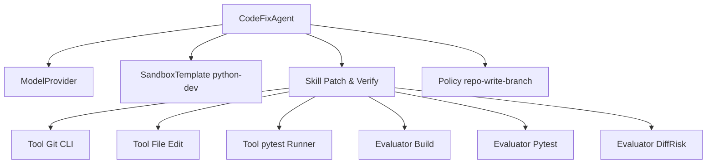
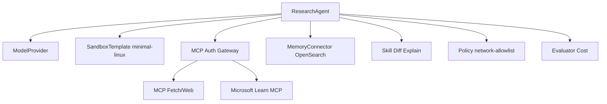
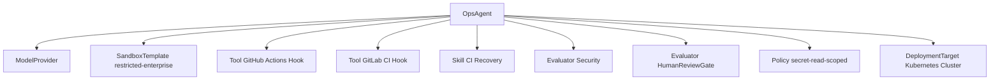

# AgentArbor 初始能力资产库研究报告

## 执行摘要

这份报告的核心结论只有一句话：**AgentArbor 不应把“模型协议、工具、MCP、Skills、沙箱、评测、权限”当作临时接线，而应把它们沉淀成可版本化、可审计、可组合、可替换的“能力资产”**。这与你上传的《能力资产资料收集清单》的总体方向是一致的：先把能力抽象成资产，再让代理在资产图谱上规划、执行、评测与治理。

从官方资料看，主流模型厂商已经在把“函数调用 / 工具调用 / 流式返回 / 长上下文 / 内置检索”做成稳定接口：OpenAI 以 Responses API 统一生成与工具编排，Anthropic 以 Messages API + Tool Use 组织代理闭环，Google Gemini 同时提供标准、流式与实时 API，阿里云百炼已明确推动从 Assistant API 迁移到 Responses API，本地栈则越来越多地通过 Ollama / vLLM 暴露 OpenAI 或 Anthropic 兼容接口。换句话说，**协议层已经足够成熟，完全值得在 AgentArbor 内部固化为“ProviderAdapter 资产”而不是每次临时适配**。

在运行时层面，沙箱已经不是"可有可无的附属件"，而是 Agent 的基本生存环境。CubeSandbox 官方仓库把目标直接定义为面向 AI Agent 的高性能安全沙箱，基于 RustVMM 与 KVM，声称可在 60ms 内创建硬件隔离环境且额外内存开销低于 5MB；Docker 官方文档则提醒 bind mount 直接把宿主路径暴露给容器，并不提供额外隔离；E2B 明确把"文件、命令、隔离代码、互联网访问"作为 Sandbox 的一等能力；Firecracker 把 microVM 的价值定义为"硬件虚拟化隔离 + 接近容器的速度"。这说明 **AgentArbor 应把"沙箱模板 + 网络策略 + 存储策略 + 密钥注入策略"一起封装成 SandboxTemplate 资产**，并且把"是否允许外网""是否允许宿主挂载""是否允许浏览器登录态"做成权限配置，而不是靠调用方自行约定。

在协议与工具接入层，MCP 值得支持，但必须带着怀疑去支持。MCP 官方规范把它定义为 LLM 应用与外部数据源、工具之间的开放协议，并给出了授权、扩展授权与 server 概念；但官方 servers 仓库同时强调这些 server 是**参考实现，不是生产级方案**。GitHub 对 MCP 的描述是“扩展 GitHub Copilot 能力的协议”，Anthropic 的安全审计 issue 甚至展示了 fetch 工具描述中“试图覆盖系统指令”的风险案例。这意味着 **MCP 资产必须进入高风险清单：所有远程 MCP server 默认不可信，必须经过来源登记、schema 约束、参数长度限制、allowlist、OAuth 或企业托管授权，以及 prompt-injection 过滤**。

因此，这份报告给出的实施建议是：**先做一个 24 项左右的 MVP 资产库**，覆盖 5 个主模型供应商画像、8 个高频工具、8 个内置技能、8 个记忆连接器、8 个 MCP/Adapter、8 个部署目标、8 个权限模板，再用 8 个自动评测器把它们闭环。这样做的收益，不是“把功能堆更多”，而是让 AgentArbor 从“会调用一堆 API 的框架”变成“拥有资产负债表的代理操作系统”。

最后是许可证与合规。你的主项目维持 MIT 没问题；如果集成 Apache-2.0 组件，工程上通常可以继续保持主项目 MIT，但需要**按组件粒度保留上游 LICENSE/NOTICE，并记录修改说明与 SPDX**。这一点从 Apache-2.0 文本要点可以直接看出：其核心义务是保留版权与许可证通知，同时附带明确的专利授权。这里给出的建议是工程合规建议，不构成法律意见。

## 研究边界与分类框架

本报告优先采用**官方 / 一手 / 可执行接口文档**作为证据来源；中文资料优先时，优先选用阿里云百炼、中文 Playwright 文档等官方或镜像文档；开源项目则优先其官方 GitHub 仓库与官方文档。之所以这样做，是因为 AgentArbor 的“能力资产”最终不是写在 PPT 上，而是要被运行时真实调用、授权、审计与升级。

建议在 AgentArbor 内部统一使用三层抽象：

1. **Capability Asset**：单个可登记对象，例如某个模型供应商接入、某个 Git 工具、某个 pytest 技能、某个 Qdrant 连接器。
2. **Capability Registry**：资产注册表，记录接口、风险、权限、成本、许可证、可靠性指标与依赖图。
3. **AssetGraph / Planner**：根据 Agent 类型与任务目标，在资产图上做最小可行组合，而不是在代码里写死。

下表给出建议采用的九类顶层分类。

| 类别 | 定义 | 资产边界 |
|---|---|---|
| ModelProvider | 提供模型推理、多模态、工具调用、流式输出、上下文管理的外部或本地推理面 | 以 API / SDK / 兼容协议为边界 |
| Tool | 原子可执行能力，如 git、shell、pytest、Playwright | 以单次调用可描述的操作为边界 |
| Skill | 由多个 Tool 组成的可复用流程，如“补丁生成+测试回归” | 以目标闭环为边界 |
| MCP/Adapter | MCP Server、协议桥接器、OpenAI/Anthropic 兼容层、内部统一 schema 适配器 | 以协议转换与能力暴露为边界 |
| SandboxTemplate | 可直接创建运行环境的镜像模板、microVM 模板、浏览器运行时模板 | 以运行时镜像+策略为边界 |
| Evaluator | 自动化评测器与门禁器，判断 build/test/diff/security/cost/human-review 是否过线 | 以判定输出为边界 |
| MemoryConnector | 对接 KV、SQL、Vector DB、Search、知识库的连接资产 | 以读写 / 检索接口为边界 |
| DeploymentTarget | 代码与代理实际运行的目标环境 | 以交付目标与运维边界为边界 |
| Policy/Permission | 代理执行时的最小权限模板 | 以授权与约束策略为边界 |

## 初始能力资产清单

下面给出的表格都采用统一风险分级：**L** = 低副作用、低外泄面；**M** = 有副作用或需要密钥；**H** = 高外泄面、高权限或会改动生产资产。
权限缩写：**repo-r** 代码只读，**repo-rw** 代码可写，**fs-rw** 文件系统可写，**net-out** 可访问外网，**db-r/db-rw** 数据库只读/可写，**ci** 可触发流水线，**browser** 可用浏览器态，**secrets** 可读取密钥。

**Capability taxonomy 对应的 ModelProvider 资产**

| 名称 | 简述 | 提供方/来源 | 接口 | 风险 | 可靠性指标 | 推荐用例 | 所需权限 | 许可证 |
|---|---|---|---|---|---|---|---|---|
| OpenAI Responses API | 文本/图像输入，统一响应接口，支持内置工具与状态化交互 | OpenAI 官方文档 
| OpenAI Realtime | 实时语音/多模态交互 | OpenAI 官方资料 
| Anthropic Messages API | 多轮消息、stop reason、tool use | Anthropic 官方文档 
| Gemini API | 标准、流式、实时 API；函数调用 | Google 官方文档 
| Gemini Interactions API | 实验性互动 API，支持研究型模式 | Google 官方文档 
| DashScope / 百炼 Responses | 千问与第三方模型统一接入，SSE 流式，向 Responses 迁移 | 阿里云官方文档 
| Azure OpenAI | Azure 上托管的 OpenAI 模型，配额/订阅治理强 | Microsoft 官方文档 
| Ollama / vLLM 本地供应层 | 本地或自托管；可暴露 OpenAI/Anthropic 兼容接口 | Ollama / vLLM 官方文档 

**Tool 资产**

| 名称 | 简述 | 提供方/来源 | 接口 | 风险 | 可靠性指标 | 推荐用例 | 所需权限 | 许可证 |
|---|---|---|---|---|---|---|---|---|
| Git CLI | clone/diff/commit/branch 基础版本控制 | Git 官方文档 
| Shell Runner | 执行系统命令与脚本 | Node/POSIX 参考 
| File Edit | 受控读写/补丁写入 | Node fs 参考 
| pytest Runner | Python 单测执行与退出码解析 | pytest 官方文档 
| Jest Runner | JS/TS 单测与过滤执行 | Jest 官方文档 
| Playwright | 跨浏览器自动化与追踪 | Playwright 中文文档 
| Ruff | Python lint/format，一体化静态检查 | Ruff 官方文档 
| Semgrep | 规则驱动 SAST/SCA/Secrets | Semgrep 官方文档 
| Trivy | 漏洞、IaC、SBOM、License 扫描 | Trivy 官方文档 
| Bandit | Python AST 安全问题检测 | Bandit 官方文档 
| HTTPX / Requests / curl | HTTP 客户端族 | 官方文档 
| SQLite / Psycopg | 本地 DB 与 PostgreSQL 连接器 | 官方文档 
| GitHub Actions Hook | 触发/读取 GitHub 工作流 | GitHub 官方文档 
| GitLab CI Hook | 触发/读取 GitLab Pipeline | GitLab 官方文档 

**Skill 资产**

| 名称 | 简述 | 提供方/来源 | 接口 | 风险 | 可靠性指标 | 推荐用例 | 所需权限 | 许可证 |
|---|---|---|---|---|---|---|---|---|
| Repo Bootstrap | clone、安装、锁依赖、生成工作分支 | AgentArbor 设计建议 | skill(ctx)->report | M | 输入固定、输出可审计 | 新仓启动 | repo-rw,net-out | MIT |
| Diff Explain | git diff→结构化变更解释 | AgentArbor 设计建议 | diff->json | L | 可复算 | Code review、PR 摘要 | repo-r | MIT |
| Patch & Verify | 修改文件→运行目标测试→回滚/保留 | AgentArbor 设计建议 | plan->patch->result | M | 有回滚点 | Bugfix、微调 | repo-rw | MIT |
| Python Test Loop | pytest 失败聚类→最小修复→重跑 | AgentArbor 设计建议 | issue->loop | M | 以退出码闭环 | Python 代理修复 | repo-rw | MIT |
| JS Test Loop | jest 失败聚类→最小修复→重跑 | AgentArbor 设计建议 | issue->loop | M | 以测试通过率闭环 | 前端/Node 修复 | repo-rw | MIT |
| Browser Repro | Playwright 录制/截图/trace→问题报告 | AgentArbor 设计建议 | url->trace | H | 截图/trace 可核对 | UI 缺陷复现 | browser,net-out | MIT |
| Security Triage | Semgrep/Trivy/Bandit 结果归并与误报压降 | AgentArbor 设计建议 | findings->triage | M | 规则可回放 | 安全审计 | repo-r | MIT |
| CI Recovery | 读取流水线失败→定位 job→建议修复 | AgentArbor 设计建议 | ci->diagnosis | H | 依赖 CI 日志 | DevOps 代理 | ci,secrets | MIT |

**MCP / Adapter 资产**

| 名称 | 简述 | 提供方/来源 | 接口 | 风险 | 可靠性指标 | 推荐用例 | 所需权限 | 许可证 |
|---|---|---|---|---|---|---|---|---|
| MCP Filesystem Server | 暴露本地文件读写能力 | MCP 官方 servers / 文档 
| MCP Git Server | 暴露仓库状态、分支、diff 能力 | MCP 官方 servers 
| GitHub MCP | 让代理读取 issue/PR/repo 上下文 | GitHub 官方文档 
| Microsoft Learn MCP | 引入可信微软文档上下文 | Microsoft 官方文档 
| MCP Fetch / Web | 远程网页抓取与实时上下文 | MCP 安全 issue / docs 
| OpenAI-compatible Adapter | 把内部 schema 映射到 OpenAI 风格 | Ollama/vLLM 官方文档 
| Anthropic-compatible Adapter | 把内部 schema 映射到 Messages API | Ollama 官方文档 
| MCP Auth Gateway | 对远程 MCP 做 OAuth / allowlist / schema 约束 | MCP 授权规范 

**SandboxTemplate 资产**

| 名称 | 简述 | 提供方/来源 | 接口 | 风险 | 可靠性指标 | 推荐用例 | 所需权限 | 许可证 |
|---|---|---|---|---|---|---|---|---|
| minimal-linux | Busy sandbox；仅 shell+git+rg | AgentArbor 模板建议 | create()->sandbox | L | 最小面、最易审计 | 只读分析、脚本执行 | repo-r | MIT |
| python-dev | Python 3.12 + uv/pip + pytest + ruff + bandit | AgentArbor 模板建议 | template id | M | 工具链固定 | Python 代码代理 | repo-rw | MIT |
| node-dev | Node + pnpm/npm + jest + Playwright | AgentArbor 模板建议 | template id | M | 前端工具链完整 | Node/前端代理 | repo-rw,browser | MIT |
| dotnet-dev | .NET SDK + xUnit/NUnit + nuget cache | AgentArbor 模板建议 | template id | M | 企业仓库适配强 | 企业 C# 代码代理 | repo-rw | MIT |
| fullstack-web | Python+Node+DB 客户端+browser | AgentArbor 模板建议 | template id | H | 适用面广 | 全栈修复、集成测试 | repo-rw,db-r,browser | MIT |
| browser-e2e | Playwright + 浏览器依赖 + trace viewer | AgentArbor 模板建议 | template id | H | trace 可回放 | UI 复现与录制 | browser,net-out | MIT |
| data-science | Python + Jupyter libs + sqlite/postgres client | AgentArbor 模板建议 | template id | M | 分析栈成熟 | 数据代理、报表生成 | fs-rw,db-r | MIT |
| restricted-enterprise | 无外网、allowlist DB、无宿主挂载 | AgentArbor 模板建议 | template id + policy | L | 最利于合规 | 企业内网生产任务 | db-r,secrets | MIT |

**Evaluator 资产**

| 名称 | 简述 | 提供方/来源 | 接口 | 风险 | 可靠性指标 | 推荐用例 | 所需权限 | 许可证 |
|---|---|---|---|---|---|---|---|---|
| BuildEvaluator | build 是否成功 | AgentArbor 设计建议 | logs->pass/fail | L | 可重复 | 所有代码任务 | repo-r | MIT |
| PytestEvaluator | pytest 通过率/退出码 | AgentArbor 设计建议 | junit/logs->score | L | 明确阈值 | Python 修复 | repo-r | MIT |
| JestEvaluator | jest 通过率 | AgentArbor 设计建议 | json/logs->score | L | 明确阈值 | JS 修复 | repo-r | MIT |
| DiffRiskEvaluator | 修改面、文件类型、删除量评分 | AgentArbor 设计建议 | diff->risk | M | 规则可解释 | 限制大改 | repo-r | MIT |
| StyleEvaluator | Ruff/ESLint 违规数 | AgentArbor 设计建议 | lint->count | L | 快速、稳定 | 代码质量守门 | repo-r | MIT |
| SecurityEvaluator | Semgrep/Trivy/Bandit 汇总 | AgentArbor 设计建议 | findings->gate | M | 扫描可复跑 | 安全门禁 | repo-r,net-out | MIT |
| CostEvaluator | token / sandbox / CI 成本预算 | AgentArbor 设计建议 | usage->budget | L | 财务可审计 | 控成本 | net-out | MIT |
| HumanReviewGate | 需要人工审批的终门禁 | AgentArbor 设计建议 | action->approval | H | 审批可追溯 | 生产写操作 | ci,secrets | MIT |

**MemoryConnector 资产**

| 名称 | 简述 | 提供方/来源 | 接口 | 风险 | 可靠性指标 | 推荐用例 | 所需权限 | 许可证 |
|---|---|---|---|---|---|---|---|---|
| SQLite / sqlite3 | 轻量本地记忆、事务型小规模状态存储 | Python 官方文档 
| PostgreSQL + pgvector | 结构化数据 + 向量相似检索 | pgvector 官方资料 
| Redis Vector Sets | 内存型语义 cache / 向量集 | Redis 官方文档 
| Chroma | 开发友好型集合、文档/embedding 一体 | Chroma 官方文档 
| Qdrant | Rust 向量检索引擎，过滤与混合查询强 | Qdrant 官方文档 
| Weaviate | 向量数据库，支持内建向量化与混合搜索 | Weaviate 官方文档 
| Milvus | 面向大规模向量检索与集合管理 | Milvus 官方文档 
| OpenSearch / Elastic | 搜索引擎与向量搜索融合 | 官方文档 

**DeploymentTarget 资产**

| 名称 | 简述 | 提供方/来源 | 接口 | 风险 | 可靠性指标 | 推荐用例 | 所需权限 | 许可证 |
|---|---|---|---|---|---|---|---|---|
| Local Docker Compose | 本机快速起环境 | Docker 官方文档 
| Self-hosted CubeSandbox | 自建高密度安全沙箱集群 | CubeSandbox 官方仓库 
| E2B Cloud Sandbox | 托管隔离沙箱 | E2B 官方文档 
| Firecracker Host | 自建 microVM 运行池 | Firecracker 官方文档 
| WebContainers | 浏览器内 Node 运行时 | WebContainers 官方文档 
| GitHub-hosted Runner | GitHub 上跑评测与部署 | GitHub 官方文档 
| GitLab Runner | GitLab 流水线目标 | GitLab 官方文档 
| Kubernetes Cluster | 标准编排目标 | Docker/Firecracker/E2B 之外的长期运行面 | k8s manifests | H | 运营成熟度高 | 多租户代理平台 | ci,secrets | 平台条款 |

**Policy / Permission 资产**

| 名称 | 简述 | 提供方/来源 | 接口 | 风险 | 可靠性指标 | 推荐用例 | 所需权限 | 许可证 |
|---|---|---|---|---|---|---|---|---|
| repo-readonly | 只读仓库，不允许写文件/提交 | AgentArbor 设计建议 | policy id | L | 最小权限 | 代码审查、解释 | repo-r | MIT |
| repo-write-branch | 允许新分支写入，不允许直接 push main | AgentArbor 设计建议 | policy id | M | 有隔离分支 | 自动修复 | repo-rw | MIT |
| shell-readonly | 仅允许无副作用命令 | AgentArbor 设计建议 | policy id | L | allowlist 可审计 | 环境探测 | repo-r | MIT |
| shell-write-guarded | 允许 build/test，不允许 rm -rf / curl|sh | AgentArbor 设计建议 | policy id | M | 黑白名单双控 | 标准开发任务 | fs-rw | MIT |
| network-none | 完全断网 | AgentArbor 设计建议 | policy id | L | 泄露面最低 | 内网敏感仓 | none | MIT |
| network-allowlist | 仅允许 docs/pkg registry/API 域名 | AgentArbor 设计建议 | policy id | M | 域名可审计 | 受控联网开发 | net-out | MIT |
| secret-read-scoped | 仅挂当前任务所需密钥 | AgentArbor 设计建议 | policy id | H | 最小 secret blast radius | 调用三方 API | secrets | MIT |
| db-readonly | 只读数据库，不允许数据写回 | AgentArbor 设计建议 | policy id | M | 防止误写 | 分析代理 | db-r | MIT |

## 供应商与协议画像

对接层的首批优先接入建议是：entity["company","OpenAI","ai company"]、entity["company","Anthropic","ai company"]、entity["company","Google","technology company"]、entity["company","Alibaba Cloud","cloud provider"] 的百炼/千问，以及本地栈（Ollama / vLLM）。企业环境若已经绑定云资源，可再补充 entity["company","Microsoft","software company"] Azure OpenAI。这样做的原因不是“品牌齐全”，而是这几类恰好覆盖了**最成熟的工具调用协议、最长上下文、中文环境、企业订阅管理与本地私有化**几条关键轴线。

下表中的“成本/时延”是**AgentArbor 侧的工程估计档位**，不是 SLA；其中 OpenAI 与 Anthropic 有公开价格表，Gemini / Qwen / 本地部署则建议在资产注册表中动态维护地区/套餐/硬件维度，不在代码里硬编码。

| 厂商 | 调用格式 | 工具调用 | 流式 | 最大上下文 | 成本/时延估计 | 已知 quirks | 推荐任务 |
|---|---|---|---|---|---|---|---|
| OpenAI | Responses API；统一响应对象；支持状态化交互。
| Anthropic | Messages API；围绕 messages、system、stop_reason。
| Google/Gemini | Gemini API 同时提供标准、流式与 Live API；Interactions API 仍属实验性。
| Qwen / 百炼 | 阿里云百炼提供模型统一入口；官方文档已推动从 Assistant API 迁移到 Responses API；流式基于 SSE。
| 本地 LLMs | 推荐以 Ollama 与 vLLM 作为供应层：Ollama 提供本地 API 与 OpenAI/Anthropic 兼容；vLLM 提供 OpenAI-compatible server。

我建议 AgentArbor 在内部定义一个**Canonical Provider ABI**，至少包含这些统一字段：`messages[] / system / tools[] / tool_choice / response_format / max_output_tokens / stream / attachments / trace_id / usage / finish_reason / tool_calls[] / tool_results[]`。这样做的目的不是抽象得更“漂亮”，而是让后续的多供应商切换、A/B 路由、降级与审计真正可行。上游差异只留在 ProviderAdapter 层。

## 沙箱、评测与元数据设计

### 沙箱模板建议矩阵

AgentArbor 的沙箱模板不应只是“装了什么包”，还应包含**网络策略、宿主挂载策略、密钥注入策略、浏览器策略、快照策略**。从官方资料看，Docker 的 bind mount 直接把宿主机路径暴露给容器；E2B 默认允许互联网访问；CubeSandbox 与 Firecracker 则更像“为隔离而生”的运行时。实际落地时，建议把模板与策略拆开：模板决定工具链，策略决定权限。

| 模板 | 基座建议 | 预装 | 默认网络 | 宿主挂载 | secrets 策略 | 适用场景 |
|---|---|---|---|---|---|---|
| minimal | CubeSandbox/Firecracker 或最小 Docker | bash、git、rg | none | 禁止 | 无 | 只读分析 |
| python | CubeSandbox / Docker | Python 3.12、uv、pytest、ruff、bandit | allowlist | 禁止 | 按任务注入 | Python 修复 |
| node | CubeSandbox / Docker | Node、pnpm、jest、Playwright | allowlist | 禁止 | 按任务注入 | 前端/Node 修复 |
| dotnet | Docker / microVM | .NET SDK、test runner | allowlist | 禁止 | 按任务注入 | 企业 .NET |
| fullstack | microVM 优先 | Python+Node+DB client+browser | allowlist | 禁止 | 最小集 | 集成测试 |
| browser | Docker / Playwright image | browser deps、trace viewer | net-out | 禁止 | 浏览器态隔离 | UI 复现 |
| data | Docker / E2B | pandas、sqlite、psycopg | allowlist db | 禁止 | db 凭据只读 | 数据分析 |
| browser-local | WebContainers | Node、npm | 浏览器侧 | 不适用 | 无服务端 secret | 教学、试玩 |

### 评测矩阵与阈值建议

评测器不是“最后补一个 tests 通过”那么简单。推荐把自动评测分成六路并行输出：**构建、测试、差异、风格、安全、成本**；任何一路不过线都不能自动落生产。对于 Python/JS 项目，底线至少应该是“能 build、目标测试全绿、无新增高危安全项、差异风险不过阈值”。pytest/Jest 的官方 CLI 与退出码都适合直接接入。

| 评测项 | 指标 | 建议阈值 | 说明 |
|---|---|---|---|
| Build | exit code | 必须为 0 | 没有构建成功就不进入后续自动提交 |
| Test | pass rate | 目标测试 100% | “只修一处导致另一处挂掉”必须被拦截 |
| Diff | 风险分 | ≤ 0.35 | 删除核心文件、改 migration、改 CI 模板需上升风险 |
| Style | lint violations | 新增 0 | 至少不引入新 lint 债务 |
| Security | high/critical findings | 新增 0 | Semgrep/Trivy/Bandit 任何一路新增高危即阻断 |
| Cost | 单任务预算 | 预设上限 | 防止无限循环修复 |
| Latency | 端到端耗时 | 模板级 SLA | 不同模板不同阈值 |
| Human review | gate | 高风险动作强制 | CI 触发、DB 写、生产部署必须升级到人工审批 |

### 规范化资产元数据 schema

下面是一份可直接放进 AgentArbor 注册表的**规范 schema**。重点不是字段多，而是三件事必须固化：**接口、权限、许可证**。

```yaml
apiVersion: agentarbor.dev/v1alpha1
kind: CapabilityAsset
metadata:
  id: tool.git.cli
  name: Git CLI
  category: Tool
  version: "2.51.x"
  owner: core-platform
  tags: [git, vcs, repo]
  spdx: GPL-2.0-only
  upstream:
    type: official-doc
    ref: git-scm
spec:
  interface:
    kind: cli
    command: git
    inputSchema:
      type: object
      properties:
        args:
          type: array
          items: { type: string }
        cwd: { type: string }
        timeoutSec: { type: integer, minimum: 1, maximum: 600 }
      required: [args]
    outputSchema:
      type: object
      properties:
        exitCode: { type: integer }
        stdout: { type: string }
        stderr: { type: string }
  permissions:
    repo: readwrite
    filesystem: scoped
    network: none
    secrets: []
  runtime:
    sandboxTemplates: [minimal-linux, python-dev, node-dev]
    os: [linux]
  risk:
    level: medium
    blastRadius: repo
    sideEffects: [writes_git_metadata, writes_worktree]
  reliability:
    indicators:
      - official_docs
      - stable_cli
      - deterministic_exit_code
  governance:
    approvalRequired: false
    deprecationPolicy: follow-upstream
    noticeFiles: [LICENSE]
status:
  maturity: ga
  verification:
    smoke: pass
    evaluatorRefs: [build, diff, human-review]
```

同一份 schema 的 JSON 表达可以直接映射到数据库或图数据库中：

```json
{
  "apiVersion": "agentarbor.dev/v1alpha1",
  "kind": "CapabilityAsset",
  "metadata": {
    "id": "provider.openai.responses",
    "name": "OpenAI Responses API",
    "category": "ModelProvider",
    "version": "dynamic",
    "owner": "provider-team",
    "tags": ["openai", "responses", "tool-calling"],
    "spdx": "commercial"
  },
  "spec": {
    "interface": {
      "kind": "rest",
      "baseUrl": "dynamic",
      "inputSchemaRef": "schemas/provider/openai-request.json",
      "outputSchemaRef": "schemas/provider/canonical-response.json"
    },
    "permissions": {
      "network": "outbound",
      "secrets": ["OPENAI_API_KEY"]
    },
    "risk": {
      "level": "medium",
      "blastRadius": "external-api"
    },
    "reliability": {
      "indicators": ["official-api", "official-pricing", "sdk-supported"]
    }
  }
}
```

## AssetGraph 与优先级路线

下面给出三个建议的 AssetGraph。它们不是“系统真相”，而是你后续实现注册表与调度器的最小起点。







### 建议的 MVP 资产清单

我建议首发只做 **24 项**，按 P0 / P1 / P2 分层。这样既足够覆盖大多数“代码修复 + 文档研究 + CI 诊断”代理，又不会在第一天就把注册表做成百科全书。

| 优先级 | 资产 | 理由 |
|---|---|---|
| P0 | OpenAI Responses Adapter | 统一现代工具调用入口 |
| P0 | Anthropic Messages Adapter | 强工具闭环与长上下文 |
| P0 | Gemini Adapter | 多模态与实时能力补足 |
| P0 | Qwen / 百炼 Adapter | 中文与区域可用性 |
| P0 | Ollama Adapter | 本地私有化最短路径 |
| P0 | Git CLI Tool | 几乎所有代码代理都依赖 |
| P0 | Shell Runner | build/test/install 的基础面 |
| P0 | File Edit Tool | 代码修复的写入基础 |
| P0 | pytest Runner | Python 修复闭环 |
| P0 | Jest Runner | JS 修复闭环 |
| P0 | Ruff Tool | 快速风格与静态错误反馈 |
| P0 | Playwright Tool | 浏览器复现与 E2E |
| P0 | minimal-linux Template | 最小安全执行面 |
| P0 | python-dev Template | Python 代码核心模板 |
| P0 | node-dev Template | Node/前端核心模板 |
| P0 | BuildEvaluator | 最底线门禁 |
| P0 | TestEvaluator | 质量闭环核心 |
| P0 | DiffRiskEvaluator | 控制“修复过猛” |
| P0 | repo-readonly Policy | 最小权限起点 |
| P0 | repo-write-branch Policy | 安全写入起点 |
| P1 | Semgrep Tool | 安全守卫前移 |
| P1 | Trivy Tool | 依赖/镜像/License 扫描 |
| P1 | SQLite Connector | 本地短期记忆最低成本 |
| P1 | PostgreSQL+pgvector Connector | 长期知识与结构化存储 |
| P1 | MCP Auth Gateway | 生产级 MCP 的前提 |
| P1 | GitHub MCP / Hook | 代码托管上下文强化 |
| P1 | CI Recovery Skill | DevOps 使用价值高 |
| P2 | Qdrant/Weaviate/Milvus 任选一 | 大规模向量检索扩展 |
| P2 | restricted-enterprise Template | 企业内网落地 |
| P2 | HumanReviewGate | 高风险动作审批闭环 |

### 建议优先采信的来源序列

你之后继续扩充资产时，建议按以下顺序采集信息，而不是“搜到什么记什么”：

1. **官方 API / 官方产品文档**：OpenAI、Anthropic、Gemini、阿里云百炼、E2B、Docker、Firecracker、GitHub、GitLab。
2. **官方 GitHub 仓库与 LICENSE**：CubeSandbox、MCP SDK/servers、vLLM、pgvector、Qdrant。
3. **中文官方资料优先**：阿里云百炼、中文 Playwright 文档。
4. **可执行规范优先于营销文案**：优先取 API 参考、schema、授权规范、退出码、配置文件语法，不优先取博客。

### MIT 项目集成 Apache-2.0 组件的工程建议

如果 AgentArbor 主仓继续采用 MIT，而内部接入部分 Apache-2.0 组件，推荐工程治理如下：

- **主仓许可证继续保持 MIT**，不要因为接入 Apache-2.0 依赖而整体改牌照。
- **每个外部能力资产单独记录 SPDX、上游仓库、锁定版本、LICENSE 路径、NOTICE 路径**。
- 若分发二进制、镜像或打包产物，**聚合 `third_party_licenses/` 与 `NOTICE`**。
- 若修改了 Apache-2.0 组件源码，**在改动说明与 NOTICE 中保留变更记录**。
- 对许可证不确定的资产，**不手填；在导入阶段自动抓取 SPDX 并进入审计队列**。
- 对商业 API 资产，**把“许可证”字段替换为“服务条款 + 数据驻留 + 日志保留 + 区域限制”**，因为这里真正的合规点不是 SPDX，而是数据处理边界。

### 开放问题与局限

- OpenAI 官方搜索结果没有像 Anthropic/Gemini 那样在检索摘要里给出统一的“最大上下文窗口”，因此报告建议对 OpenAI 相关能力采用**运行时动态探测**而非静态硬编码。
- 若你要把“许可证列”做成真正可审计数据，下一步最值得自动化的是：**从 package manager / GitHub API / LICENSE 文件自动回填 SPDX 与 NOTICE 义务**；本报告中少数字段已明确标注“待锁版抓取”。这一点很重要，因为开源项目许可证会变更，且发行版可能分叉。
- MCP 生态扩张很快，但官方 servers 仓库也明确说它是参考实现，不应直接等同于生产质量；因此 **AgentArbor 的资产登记必须把“来源可信度”和“生产成熟度”分开建模**。

综合判断，AgentArbor 最值得优先沉淀的不是“更多功能”，而是这四样基础设施：**统一 Provider ABI、带权限的 SandboxTemplate、可审计的 Capability Registry、以及自动化 Evaluator 门禁**。只要这四样先立住，后续无论你要接 MCP、插件、Skills、厂商私有协议，还是新的 sandbox/runtime，本质上都只是往资产表里加行，而不是把系统架构重新推倒。
