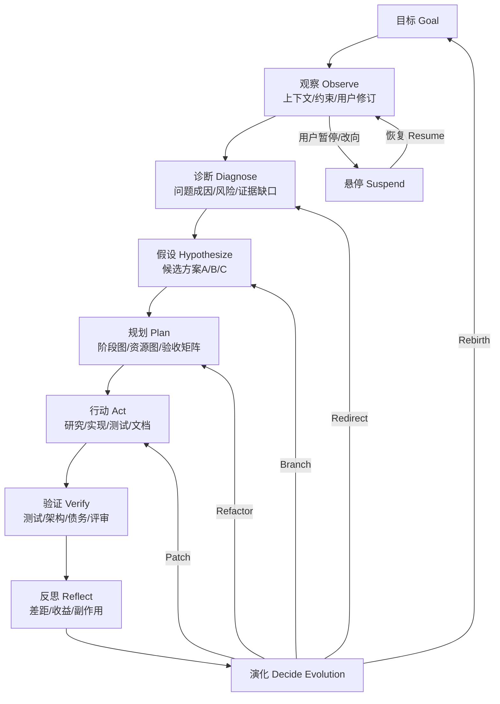
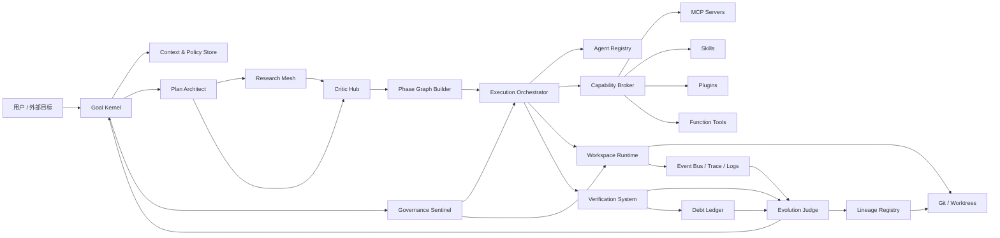
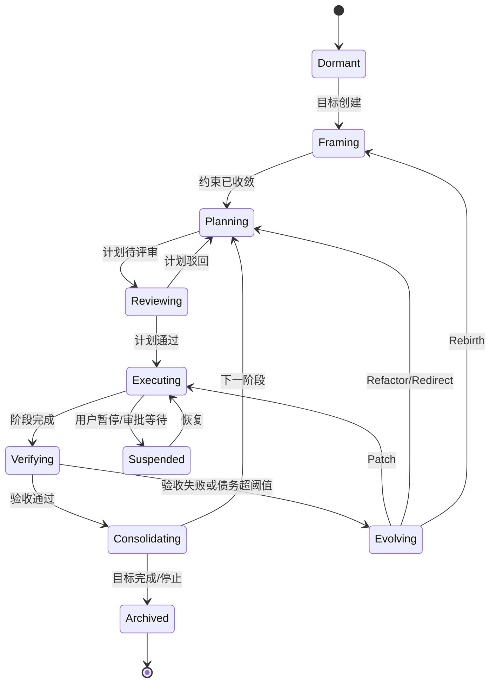

# AgentArbor 深度研究报告

## 执行摘要

AgentArbor 应被定义为一个**目标驱动、可追溯、可暂停、可分叉、可重生的自主多 Agent 软件生命周期平台**，而不是一个“把需求喂进去、按固定模板吐出代码”的流水线。它的核心不是某个固定工作流，而是一个围绕**目标、证据、验证、演化**不断循环的元系统：先形成目标与约束，再动态组织规划、研究、执行、验证、反思与演化动作；当后续证据表明当前路线不优时，系统可以选择打补丁、局部重构、重定向、策略分叉，甚至提出“重生”方案，而不是把错误路线机械执行到底。这个判断方向与官方 Agent 设计建议一致：先用尽量简单的代理结构起步，只在复杂逻辑或工具过载出现时再拆分为多 Agent；多 Agent 编排也不必只走一种模式，LLM 决策与代码编排可以混合使用。

AgentArbor 之所以“有能力自主迭代并生成 agent”，不应该靠一句抽象口号，而要靠五个可落地的能力闭环：第一，**目标核与状态机**，把“当前目标—阶段—约束—风险—暂停点—验收矩阵”显式化；第二，**Capability Fabric**，统一管理 MCP、函数工具、skills、子 agent、插件、工作流与工作区权限；第三，**Execution Runtime**，以事件、追踪、日志、Git、工作区与可恢复运行态承接真实执行；第四，**Verification System**，用测试、架构检查、债务检查、评审、grader/eval 做结果约束；第五，**Evolution System**，把 Patch / Refactor / Redirect / Branch / Rebirth 作为受策略控制的演化动作，而不是临时拍脑袋决定。MCP 官方规范已经把生命周期、JSON-RPC 消息、工具/资源/提示词、根目录、采样、用户征询、进度、取消、任务、授权与日志等能力拆成清晰层次；OpenAI 的 Agents SDK 也已把工具、handoff、guardrail、trace、session、sandbox、approval、RunState、stream event 和 eval surface 做成组合式基础件。这意味着 AgentArbor 并不是从零发明“自主性”，而是把这些原子能力组织为一个更高阶的、带谱系感的生命系统。

本报告的核心结论是：**AgentArbor 的“灵魂”不在于模仿人的对话风格，而在于能对目标保持忠诚、对证据保持敏感、对错误保持可逆、对历史保持可追溯、对未来保持可分化。** 因而它的最小可行版本不应该一开始就追求“无限能力”，而应该优先实现：目标建模、阶段规划、子 Agent 组织、工作区/Git 隔离、事件追踪、验收矩阵、债务账本、演化裁决、人工确认与中断恢复。等这些生命支撑系统具备后，再扩展更多 MCP、skills、插件与行业专用 agent。这样做既符合官方关于“先简单、后拆分、再优化”的经验，也更能避免早期陷入局部最优和技术债泥潭。

本报告同时给出一套可复制的交付结构，包括 `arbor.json`、阶段计划、演化计划、重生提案、`.agent` 定义、skill 文件、workflow 文件与 `phase-01.json` 任务图示例。对于上游尚无统一标准的部分——尤其是 `.agent` 文件本身、AgentArbor 的插件清单格式，以及 skills 在 MCP 中的正式协议形态——本文会明确标注为**AgentArbor 内部规范**或“**未指定**”。目前 MCP 社区已经成立 “Skills Over MCP” 工作组，方向是把 skills 作为基于现有 Resources/Extensions 的可发现、可分发、可消费能力来规范化，但截至本报告引用的公开资料，该能力仍在推进中，不应被误当成已经稳定的通用标准。

## 产品定位与目标驱动元循环

AgentArbor 的产品定位可以概括为一句话：**一个面向复杂软件生命周期的自治操作系统，而不是单次生成器。** 它面向的不是“写一个函数”这种一次性任务，而是“在数周到数月内围绕一个持续变化的产品目标，自主推进、验证、修正、分叉、维护与再孵化”的长期工程过程。OpenAI 对 agent 的定义强调，agent 不是简单调用模型，而是一个能借助模型来管理工作流执行、动态选择工具、在失败时纠偏或把控制权交还用户的系统；其基础件包括模型、工具与指令。这个定义非常适合 AgentArbor，但 AgentArbor 要在其上再补上“版本谱系、工程验证、债务治理、分化与重生”四层。

从用户价值看，AgentArbor 的核心价值主张不是“更快写代码”，而是这四点。第一，**把模糊目标转成持续推进的阶段系统**。第二，**把复杂的多 Agent 协作从静态流程变成动态编排**。第三，**把每次变更都锚定在可验证的证据与 Git 谱系上**。第四，**把软件演化从被动返工升格为一等能力**。这意味着它不应把自己包装成“万能开发助手”，而更像“具备自我约束与自我进化能力的工程中枢”。

为了避免工作流模板化，AgentArbor 的主循环应当设计成**目标驱动元循环**而非单向流水线。OpenAI 的多 Agent 官方文档指出，编排有两种主要方式：让模型决定下一步，或用代码决定流程，而且两者可以混合；官方实践指南则建议先尽量用单 Agent，把复杂性控制住，仅在逻辑分支复杂、工具重叠严重或路由稳定性变差时再拆成多 Agent。AgentArbor 应据此采用一个“**固定内核 + 动态外化**”结构：固定的是目标—证据—执行—验证—演化—治理这些内核环节；不固定的是每一轮要召唤多少 agent、以 manager 模式还是 handoff 模式组织、是否需要研究网格、是否要分叉验证多方案。

下面这张图给出推荐的元循环。它不是顺序模板，而是一个可回跳、可暂停、可分叉、可重生的闭环。



在组织形态上，我建议 AgentArbor 使用一套与“树”意象一致的**三层组织**：

- **冠层 Canopy Layer**：元控制层。负责目标核、演化裁决、治理策略、人工确认、谱系管理。这里的 agent 不能沉迷局部任务，必须只看目标、证据与风险。
- **干层 Trunk Layer**：阶段管理层。负责规划、研究、执行、验证、发布四类相对稳定的域能力。它们是主干，不直接拥有最终主权，但承接绝大多数协调与调度。
- **根层 Root Layer**：能力执行层。包含子 agent、技能包、工具命名空间、MCP server、插件、脚本、测试执行器、文档生成器等。根层负责接触外界与土壤，吸收上下文、调用外部系统、操作工作区。MCP 的 host/client/server 分层、Roots 边界、工具/资源/提示词三种 server primitive，与这种“根层吸收外部能力、上层进行结构化利用”的设计高度兼容。

在这一组织之上，我建议把“必须 agent”定义为**逻辑角色**而不是“必须独立进程”。MVP 中，这些角色可以合并到少数 agent；成熟版中再拆开。逻辑上必须存在的角色包括：`GoalSteward`、`CapabilityBroker`、`PlanArchitect`、`ResearchLead`、`CriticAgent`、`ExecutionForeman`、`Verifier`、`EvolutionJudge`、`GovernanceSentinel`、`LineageKeeper`。其中最不可缺的是前三者、验证者、演化裁决者与治理哨兵，因为没有它们，自主性就会退化为单次工具调用串联。

## 系统架构

AgentArbor 的推荐总体架构如下。它遵循“策略面与执行面分离、状态显式化、证据优先、Git 与事件双账本并行”的原则。



这套架构里最重要的思想是：**任何“自主动作”都必须能被还原到目标、策略、事件、变更与验收结果。** 官方 MCP 架构文档明确指出，MCP 数据层与传输层是分离的；数据层通过 JSON-RPC 承担生命周期、工具、资源、提示词、client feature 与通知，传输层则承载通信与认证。OpenAI 的 Agents SDK 则把 turns、tool calls、handoffs、guardrails、stream events、RunState、sandbox 与 session 暴露成可组合积木。AgentArbor 应顺着这个方向，把“自治”做成可审计的编排，而不是隐藏在长提示词里的魔法。

### 模块清单

下表给出建议的一等模块。此表是 **AgentArbor 内部架构提案**，不是上游协议原文。

| 模块 | 职责 | 输入 | 输出 | 关键接口 | 关键事件 | 示例 |
|---|---|---|---|---|---|---|
| Goal Kernel | 维护目标、约束、阶段状态、停止条件 | 用户目标、环境约束、验收标准 | 当前目标态、阶段态、策略上下文 | `createGoal()`, `updateGoal()`, `freezeGoal()` | `goal.created`, `goal.updated`, `goal.suspended` | 用户把“做 SaaS”改成“先做内测后台” |
| Context & Policy Store | 保存策略、边界、预算、审批规则 | 组织策略、风险等级、权限模板 | 运行时策略视图 | `resolvePolicy(scope)` | `policy.changed` | 生产库写操作需人工审批 |
| Capability Broker | 按任务解析可用能力，做命名空间与权限裁剪 | 任务需求、agent 画像、权限 | 能力清单、能力句柄 | `resolveCapabilities(requirements)` | `capability.bound`, `capability.denied` | 只暴露只读 Git/MCP 能力给研究 agent |
| Plan Architect | 形成阶段计划、任务图、资源图 | 目标态、研究证据、历史结果 | phase plan、task graph | `draftPlan()`, `refinePlan()`, `buildPhaseGraph()` | `plan.drafted`, `phase.graph.built` | 生成 P0/P1/P2 阶段图 |
| Research Mesh | 多方案调研与证据收集 | 待决策问题、来源约束 | 方案集合、风险清单、证据包 | `spawnResearchThreads()` | `research.started`, `research.completed` | 对 Next.js / Nuxt / SvelteKit 并行比较 |
| Critic Hub | 对计划、设计、实现做对抗性评审 | 计划稿、设计稿、补丁集 | 缺陷、替代方案、风险建议 | `reviewPlan()`, `reviewPatch()` | `critic.issue.raised` | 指出当前 DB 设计会导致租户隔离困难 |
| Execution Orchestrator | 决定每阶段使用 manager 还是 handoff，分派 agent 与任务 | phase graph、可用能力、验证反馈 | run queue、agent 分派、执行结果 | `dispatch()`, `rebalance()` | `task.assigned`, `handoff.requested` | 把 API、前端、文档、测试分别派单 |
| Workspace Runtime | 管理工作区、命令执行、文件编辑、快照、回滚 | 任务、补丁、命令、工作区映射 | 工件、日志、diff、快照 | `createWorkspace()`, `applyPatch()`, `runShell()` | `workspace.created`, `patch.applied`, `command.finished` | 为 phase-01 创建独立 worktree |
| Verification System | 跑测试/eval/架构审查/债务审查/文档完整性检查 | 工件、变更集、验收矩阵 | 验收结果、grader 分数、失败报告 | `runAcceptance()`, `runGraders()` | `verification.started`, `verification.failed`, `acceptance.passed` | 覆盖率不足则拒绝合并 |
| Debt Ledger | 维护结构债、测试债、文档债、决策债 | diff、审查结论、例外批准 | 债务账本、债务趋势 | `recordDebt()`, `estimatePressure()` | `debt.recorded`, `debt.threshold.hit` | 临时绕过缓存失效方案被记为债务 |
| Evolution Judge | 对 Patch/Refactor/Redirect/Branch/Rebirth 进行裁决 | 验收结果、债务账本、追踪数据 | 演化决策、提案文件 | `decideEvolution()` | `evolution.patch`, `evolution.rebirth.proposed` | 连续三次补丁失败后转入重构 |
| Governance Sentinel | 危险命令拦截、审批、用户暂停/恢复 | 待执行动作、风险标签、用户指令 | 审批结果、中断态 | `approve()`, `pauseRun()`, `resumeRun()` | `approval.requested`, `run.paused`, `run.resumed` | 删除数据、网络写操作需确认 |
| Lineage Registry | 维护 AgentArbor 谱系、分支、重生、祖先关系 | 当前版本状态、Git ref、演化结果 | `arbor.json`、lineage records | `writeLineage()`, `forkLineage()` | `lineage.forked`, `lineage.reborn` | 从 v0.4 分化出行业版 Arbor |

### 状态机

要让“自主性”真正可控，AgentArbor 必须把运行态与演化态显式化。下面给出推荐状态机。



OpenAI 的 RunState 被设计为可序列化的暂停/恢复边界，保存响应、物品、审批态与对话标识；MCP 则在取消、进度与实验性的任务能力中，把长运行请求做成可通知、可轮询、可取消、可恢复的状态机器。这些都支持 AgentArbor 把“暂停”“等待审批”“等待外部输入”“阶段悬停”做成一等状态，而不是依赖内存中的临时变量。

### 事件模型

AgentArbor 应采用**事件优先**的数据骨架。推荐把事件分五类：

1. **Intent events**：目标创建、修改、冻结、优先级变更。
2. **Run events**：任务领取、handoff、tool call、agent tool invocation、stream event。
3. **Workspace events**：文件变更、补丁应用、命令执行、构建产物、快照。
4. **Verification events**：测试结果、grader 分数、架构评审、债务入账。
5. **Evolution events**：patch/refactor/redirect/branch/rebirth 提议与决定。

OpenAI 的 tracing 文档说明，trace 可以记录 LLM generation、tool calls、handoffs、guardrails 与 custom events；streaming 还定义了 `tool_called`、`tool_output`、`handoff_requested`、`mcp_approval_requested`、`mcp_list_tools` 等语义流事件。AgentArbor 最好直接采用相近的事件命名思路，这样追踪层与业务层之间可以天然对齐。

## Capability Fabric 与 Execution Runtime

Capability Fabric 是 AgentArbor 与普通“多 Agent 流程器”的分水岭。没有它，Agent 数量再多，也只是互相调用提示词；有了它，Agent 才能被“孕育、成长、分化、重生”。

### Capability Fabric 的定义

在本报告中，Capability Fabric 指的是一个**统一能力织网**，它把以下对象放到同一解析面上：

- **内置能力**：Git、worktree、patch、shell、文件编辑、测试、构建、文档生成、债务检查、trace 导出等。
- **MCP 能力**：本地/远程 MCP server 暴露的工具、资源、提示词与 client feature。
- **Function tools**：普通函数工具与名字空间工具。
- **Agent tools / handoffs**：把 agent 作为工具，或在 agent 间 handoff。
- **Skills**：可被按需加载的知识/流程包。
- **Plugins**：由用户安装或内建的扩展包。
- **Workflows**：不是死模板，而是可选的策略蓝图与编排器配置。
- **Policies**：审批要求、网络边界、机密级别、只读/可写范围。

OpenAI 的工具与 tool search 文档明确建议：当工具表面很大时，优先把工具按 namespace 或 MCP server 分组，而不是用一大串平铺函数；tool search 允许在运行时只加载所需工具；名字空间最好保持小而清晰，经验上每个 namespace 控制在约 10 个函数以内更利于性能与模型选择。对远程 MCP，`allowed_tools` 可以收窄暴露面，而且 OpenAI 默认会先走审批流程，以免模型把不该共享的数据发给第三方。AgentArbor 的 Capability Fabric 应完全吸收这套思想：**能力必须按意图分组、按权限裁剪、按场景延迟加载。**

### AgentArbor 推荐的高价值内置能力

以下能力应优先内建，而不是放到“用户以后再装”：

| 能力 | 价值 |
|---|---|
| Git worktree / branch / commit / tag | 支撑并行实验、阶段隔离、谱系管理、分叉与重生 |
| Patch / file edit / diff | 最基本的工程执行能力 |
| Shell / task runner | 构建、测试、迁移、代码生成、静态分析都依赖它 |
| Test / lint / typecheck / coverage | 验证闭环核心 |
| Web / file search | 研究与项目上下文获取 |
| Trace / log / event export | 自治系统需要可解释性 |
| Debt ledger analyzer | 避免局部最优与技术债扩散 |
| Architecture inspector | 结构依赖、边界检查、反模式发现 |
| Eval / graders runner | 非功能质量、工具调用质量、规划质量的量化基础 |
| Approval / policy engine | 安全、合规、人工确认入口 |
| MCP broker | 标准接入外部工具、资源与 UI 元数据 |
| Doc pack generator | 每阶段输出可审阅文档，降低“黑箱感” |

关于 Git 作为能力骨架的地位，Git 官方文档强调 Git 的核心是**快照**而不是差异流，branch 本质上是指向提交的轻量指针，且极低成本；`git worktree` 允许同一仓库同时检出多个分支，这对 AgentArbor 的并行实验、支线验证、保留主线稳定态非常关键。

### MCP、skills、`.agent` 与插件规范

这里要明确区分“上游标准”和“AgentArbor 内部约定”。

**MCP** 是上游开放协议，其核心是 JSON-RPC 消息、生命周期协商、工具/资源/提示词、roots、sampling、elicitation、authorization、progress、cancellation、logging 与实验性的 tasks。AgentArbor 不应重新造一套外部能力接入协议，而应把 MCP 作为第一公民。

**skills** 目前处于“生态已活跃、规范仍在推进”的阶段。MCP 官方文档已把 skills 描述为可移植指令集，通常由 `SKILL.md` 和参考资料目录组成；MCP 社区也已成立 Skills Over MCP 工作组，目标是定义 skills 的发现、分发与消费方式，但该方向尚未统一定型。对于 AgentArbor 来说，最佳策略不是等待统一标准落地，而是先定义**内部兼容格式**，未来再对接上游扩展。

**`.agent`**：上游官方未提供统一的 `.agent` 文件规范，故本报告将其定义为 **AgentArbor 内部规范**。它的内容应映射到 OpenAI Agent 定义中的核心字段：name、instructions、tools、handoffs、guardrails、output schema、mcp servers、hooks、policy 等。上游官方明确说明，一个 agent 是由 instructions、tools、guardrails、handoffs 等构成的可配置对象；这正是 `.agent` 应承载的最小语义集。

**插件**：上游“插件”概念未指定统一文件格式，因此本报告也将其视为 **AgentArbor 内部规范**。插件建议包含：manifest、能够提供的 capabilities、权限需求、事件订阅、版本和兼容矩阵。若插件本身暴露工具，优先通过 namespace 或 MCP server 暴露，不建议把大量裸函数直接平铺给模型。

### 推荐内部规范要点

`.agent` 内部规范建议至少包含这些字段：

- `id`, `name`, `role`, `objective`
- `instructions`
- `inputs`, `outputs`
- `tools`, `mcp_servers`, `skills`
- `handoffs`, `manager_policy`
- `guardrails`, `approval_policy`
- `budgets`：token / time / risk / cost
- `success_criteria`
- `lineage`

`skill` 文件建议使用 Markdown + front matter：

- `id`, `name`, `version`, `triggers`
- `capabilities_required`
- `instructions`
- `references`
- `quality_checks`

插件 manifest 建议使用 YAML/JSON：

- `name`, `version`, `kind`
- `capabilities_provided`
- `permissions_required`
- `events_subscribed`
- `compatibility`
- `healthcheck`

### Execution Runtime

Execution Runtime 要解决的是：“当 AgentArbor 真正进入执行态时，靠什么站稳？”答案是五件事：

第一，**工作区隔离**。OpenAI 的 sandbox agents 文档把 agent loop 的控制平面与 compute 执行平面分离：控制平面负责模型调用、handoff、approval、tracing、run state，执行平面负责文件、命令、依赖、端口与快照。AgentArbor 在理念上应完全照这个边界做：控制面不直接碰高风险环境，执行面只拿最小权限。

第二，**会话与状态**。Agents SDK 的 session 用于存历史，Conversation/Responses API 也支持持久会话、`previous_response_id` 链接与 compaction。AgentArbor 需要把“上下文历史”“阶段知识”“谱系信息”三种状态分开管理：会话只管对话历史，阶段知识进入 `phase_plan` 与 skill memory，谱系信息进入 `arbor.json`。长程运行时应该使用可压缩上下文，避免把所有历史都反复塞进上下文窗口。

第三，**事件与追踪**。Tracing 必须默认打开。OpenAI 明确说明 tracing 默认启用，并能记录 generation、tool calls、handoffs、guardrails 和 custom events。AgentArbor 应把 trace 作为第一账本，把 Git 作为第二账本；一个告诉你“系统当时怎么想”，另一个告诉你“系统做了什么改动”。

第四，**长任务与可恢复性**。MCP 的 progress、cancellation、tasks，以及 OpenAI 的 RunState/HITL，共同表明：现代 agent 编排不该假设“一次 run 必定很快结束”。AgentArbor 应面向长任务，用 progress token、任务状态、safe point、暂停快照、task result retrieval 做恢复。

第五，**Git 年轮**。AgentArbor 的每一阶段都应落在 Git 快照上：阶段前创建 worktree 或阶段分支，阶段后写入有结构的 commit/tag，并在 `arbor.json` 中记录 phase、trace、verification、evolution decision 到 Git ref 的映射。Git 的快照与轻分支特性，为“分化”与“重生”提供了天然载体。

## Verification、Evolution 与 Governance

### Verification System

AgentArbor 不能把“能跑起来”当成完成。Verification System 应该使用**验收矩阵**而不是单一测试。OpenAI 官方 eval 文档强调 trace、graders、datasets、eval runs 是 agent workflow 质量治理的重要表面；grader 还可针对工具调用单独检查函数名与参数。AgentArbor 应据此把验收拆成至少六个维度：功能、回归、结构、债务、安全、交付完整性。

建议的验收矩阵如下。这是 **AgentArbor 内部策略提案**。

| 维度 | 检查内容 | 初始阈值 |
|---|---|---|
| 功能验收 | 需求用例通过率 | `>= 95%` |
| 自动测试 | 单元/集成/端到端 | 核心路径全绿；阻断用例 `100%` |
| 代码质量 | lint/typecheck/build | 必须全绿 |
| 架构健康 | 循环依赖、边界越权、公共接口污染 | 重大问题 `0` |
| 技术债务 | 新增高危债务项、临时绕过、TODO 爆炸 | 高危债务 `0`；一般债务需记账 |
| 文档完整性 | README、phase plan、变更说明、运维说明 | 阶段收口前必须齐全 |
| 工具调用质量 | 工具选择正确率、参数正确率 | `>= 90%` |
| 成本与时延 | token、执行时长、重试次数 | 不超过 phase budget |

这里的“工具调用质量”可以直接借鉴 grader 思路，对工具名与参数分别评分。

### 避免局部最优与技术债

避免局部最优不是一句“多想几种方案”就能解决，它必须制度化。我的建议是四道防线：

**多方案竞争**。重要设计决策至少保留 A/B 两案；如果两案综合评分差小于 10 分，不直接单线推进，而进入 branch 验证。这样做不是犹豫，而是用实验换确定性。

**CriticAgent 常驻**。CriticAgent 不参与实现，只做“为什么你现在这条路可能错了”的工作。它必须有否决权，但不能直接落代码。这样可以防止执行 agent 因为沉没成本而一路补丁到底。

**债务账本**。所有“先这样吧”的决策都必须入账，并且带上偿还触发条件。债务分为结构债、测试债、文档债、决策债、权限债。没有账本，技术债就只会留在聊天记录里，几天后没人记得。

**未来压力测试**。每个阶段收口前，对提案施加未来约束压力：两倍用户量、团队扩张、权限细化、多租户、离线场景、国际化、替换供应商、合规要求。如果当前结构在这些假设下出现明显脆弱点，则优先重构而不是继续增量补丁。

这套治理也符合 OpenAI 的“先用 eval 建立基线，再在满足准确性目标的前提下优化成本与延迟”的原则：不要因为局部速度而提前锁死结构。

### Evolution System

这是 AgentArbor 的灵魂部件。建议把所有演化动作收敛为五类：

- **Patch**：局部修补，不改变结构意图。
- **Refactor**：重组内部结构，不改变目标路径。
- **Redirect**：目标不变，但技术路线或阶段路线改变。
- **Branch**：保留现路径，同时开出竞争性子路径。
- **Rebirth**：认为当前 Arbor 的核心前提已失效，提出新代 Arbor，并继承谱系而非隐形覆盖。

下面给出推荐判定表。阈值是 **AgentArbor 初始政策**，后续应根据项目数据调参。

| 决策 | 触发条件 | 推荐阈值 | 处理动作 |
|---|---|---|---|
| Patch | 问题局部、影响面小、结构本身仍成立 | 触及 `< 3` 个模块；无公共接口破坏；新增债务 `<= 2` 分 | 直接补丁，进入同阶段回归验证 |
| Refactor | 同一模块反复补丁、可维护性显著下降 | 14 天内同模块补丁 `>= 3` 次；债务分 `> 8/20`；复杂度增幅 `> 20%` | 回到规划层，重写该模块结构方案 |
| Redirect | 当前路线虽能做完，但长期收益明显差 | 验收通过但架构适配度 `< 70/100`；或关键非功能目标持续失配 `>= 2` 轮 | 改变技术栈/分层/阶段顺序 |
| Branch | 两个方向都可行，证据尚不充分 | 方案综合评分差 `< 10`；关键假设未证实；收益/风险曲线分歧大 | 开分支实验，限定预算与截止点 |
| Rebirth | 当前 Arbor 的核心假设失效 | 核心约束变化影响 backlog `> 40%`；架构适配度 `< 60/100` 且经历 `>= 2` 轮重构仍无改善；用户明确改向 | 产出 `rebirth-proposal.md`，新 Arbor 继承 lineage |

“架构适配度”推荐由五项加权组成：目标匹配 30、可验证性 20、可演化性 20、权限安全 15、运行成本 15。

真正关键的是：**后阶段发现的问题可以影响前阶段成果，但方式不是任意倒流，而是通过 Evolution Judge 发起正式演化决策。** 也就是说，AgentArbor 允许“推倒重来”，但必须留下证据链：为什么重来、重来成本、保留什么、丢弃什么、如何继承 lineage。这样“重生”不是灾难，而是系统的一种正当生长方式。

### Governance

自主性必须有栅栏。OpenAI 的 guardrails 与 human review 文档明确把自动检查与人工审查定义为决定 run 是继续、暂停还是停止的机制；HITL 文档也说明了对敏感工具调用的暂停、审批和恢复模式。AgentArbor 应至少有三级治理。

**一级：自动 guardrails**
输入、输出、工具行为、权限越界、敏感数据泄露、危险命令检测。
阻断条件：命中高危策略则立即阻断；中危触发审批；低危写日志。

**二级：危险命令策略**
建议的默认危险操作清单：

- 删除/覆盖生产数据
- 写外部系统、发消息、支付、发版
- 直接修改 secrets / credentials / 权限策略
- 访问未授权目录、根目录之外的数据源
- 远程网络写操作
- 对用户未明确授权的第三方 MCP server 发送数据

**三级：人工确认策略**
建议采用风险矩阵：

| 风险级别 | 示例 | 默认策略 |
|---|---|---|
| 低 | 本地只读搜索、生成文档、跑单元测试 | 自动执行 |
| 中 | 本地写文件、创建分支、安装依赖、调用只读外部 MCP | 可自动，但要可回滚并记录 |
| 高 | 删除/迁移数据、写外部系统、发版、付费调用、大规模重构 | 必须审批 |
| 极高 | 生产环境不可逆操作、权限变更、对外发信/支付 | 必须双确认 |

### 用户中断与悬停策略

用户如果在后续迭代中主动停止自主迭代，AgentArbor 不应“要么完全杀死，要么继续失控”。正确策略是**安全悬停**：

1. 停止发起新的高风险动作。
2. 让当前原子步骤到达 safe point，或执行回滚。
3. 序列化 RunState / task state / phase context。
4. 刷新 trace 与 debt ledger。
5. 将工作区落到一个可恢复的 Git 快照。
6. 生成 `pause_summary.md`，说明做到哪、未完成什么、恢复入口在哪。
7. 进入 `Suspended` 状态，等待恢复、归档或重定向。

MCP 的取消通知、任务取消与状态轮询；OpenAI 的 RunState、stream cancellation 与 Conversations/compaction，都为“可暂停而不丢态”提供了现成支点。

## 交付文件夹与关键文件内容

### 示例文件夹结构

下面给出一套可直接作为 AgentArbor 研究交付物的目录骨架。所有文件均为**示例内容**；其中 `.agent`、插件约定、`arbor.json` 字段等为 **AgentArbor 内部规范提案**。

```text
AgentArbor/
├── README.md
├── arbor.json
├── phase_plan.md
├── evolution-plan.md
├── rebirth-proposal.md
├── phases/
│   └── phase-01.json
├── agents/
│   ├── goal-steward.agent
│   ├── plan-architect.agent
│   ├── critic.agent
│   ├── execution-foreman.agent
│   └── verifier.agent
├── skills/
│   ├── architectural-review.md
│   ├── git-lineage.md
│   └── debt-ledger.md
├── workflows/
│   ├── autonomous-iteration.yaml
│   └── phase-execution.yaml
├── policies/
│   ├── approvals.yaml
│   └── dangerous-commands.yaml
├── docs/
│   ├── architecture.md
│   ├── acceptance-matrix.md
│   └── lineage.md
└── evals/
    ├── graders.yaml
    └── eval-plan.md
```

### 文件夹清单表

下表就是用户要求的“可下载文件夹清单表”的 Markdown 版本；可直接复制到本地保存。

| 路径 | 用途 | 简短示例内容 |
|---|---|---|
| `README.md` | 项目入口与运行说明 | “AgentArbor 是目标驱动自治软件生命周期平台” |
| `arbor.json` | Arbor 谱系、目标、阶段、策略、能力快照 | `{"arbor_id":"arb_demo","lineage":{...}}` |
| `phase_plan.md` | 阶段计划总览 | P0 目标、P1 API、P2 UI、验收矩阵 |
| `evolution-plan.md` | 本轮演化策略与触发条件 | Patch/Refactor/Redirect/Branch/Rebirth 决策表 |
| `rebirth-proposal.md` | 当出现“重生”时的正式提案 | 背景、失败根因、保留资产、迁移路线 |
| `phases/phase-01.json` | 阶段任务图 | 任务 DAG、依赖、负责人角色、预算 |
| `agents/goal-steward.agent` | 目标核 agent 规范 | 维护目标、约束、暂停/恢复策略 |
| `agents/plan-architect.agent` | 规划 agent | 生成阶段图与任务图 |
| `agents/critic.agent` | 对抗评审 agent | 对计划/补丁做红队审视 |
| `agents/execution-foreman.agent` | 执行编排 agent | 选择 manager/handoff、任务分发 |
| `agents/verifier.agent` | 验证 agent | 跑验收矩阵与输出结论 |
| `skills/architectural-review.md` | 架构评审 skill | 检查边界、耦合、可演化性 |
| `skills/git-lineage.md` | 谱系/Git 操作 skill | 分支、tag、lineage 写入规范 |
| `skills/debt-ledger.md` | 债务治理 skill | 债务打分与偿还触发条件 |
| `workflows/autonomous-iteration.yaml` | 元循环工作流蓝图 | Observe→Plan→Act→Verify→Evolve |
| `workflows/phase-execution.yaml` | 阶段执行蓝图 | plan-reviewed → executing → verifying |
| `policies/approvals.yaml` | 审批矩阵 | 风险级别到审批策略映射 |
| `policies/dangerous-commands.yaml` | 危险命令清单 | `rm -rf`, DB drop, prod deploy |
| `docs/architecture.md` | 架构说明 | 模块、事件、状态机 |
| `docs/acceptance-matrix.md` | 验收矩阵 | 测试、债务、文档、架构要求 |
| `docs/lineage.md` | 谱系解释 | Arbor 与 Git 分支映射说明 |
| `evals/graders.yaml` | grader 定义 | 工具调用正确性评分 |
| `evals/eval-plan.md` | eval 计划 | 样本集、指标、基线 |

### `arbor.json` 示例

```json
{
  "schema_version": "0.1.0",
  "arbor_id": "arb_demo_001",
  "name": "AgentArbor Demo Arbor",
  "status": "planning",
  "goal": {
    "title": "构建一个可自主迭代的软件生命周期平台 MVP",
    "north_star": "在明确目标下持续生成计划、执行、验证与演化决策",
    "constraints": [
      "优先后端",
      "必须可暂停与恢复",
      "必须保留 Git 谱系"
    ],
    "success_criteria": [
      "能生成阶段计划与任务图",
      "能在 worktree 中执行并通过验收",
      "能根据验证结果触发 patch/refactor/branch/rebirth"
    ]
  },
  "lineage": {
    "parent_arbor_id": null,
    "branch_of": null,
    "rebirth_from": null,
    "git": {
      "repo": "未指定",
      "default_branch": "main",
      "current_ref": "refs/heads/arbor/demo"
    }
  },
  "policies": {
    "approval_profile": "default-high-safety",
    "network_policy": "restricted",
    "dangerous_commands_profile": "strict"
  },
  "capability_fabric": {
    "builtins": [
      "git",
      "worktree",
      "patch",
      "shell",
      "test",
      "trace",
      "debt-ledger"
    ],
    "mcp_servers": [],
    "skills": [
      "architectural-review",
      "git-lineage",
      "debt-ledger"
    ],
    "plugins": []
  },
  "phases": [
    {
      "id": "phase-01",
      "title": "规划与内核骨架",
      "status": "planned",
      "phase_file": "phases/phase-01.json"
    }
  ],
  "evolution": {
    "last_decision": "none",
    "decision_thresholds": {
      "patch_max_modules": 3,
      "refactor_repeat_patches_14d": 3,
      "redirect_fitness_threshold": 70,
      "branch_score_gap": 10,
      "rebirth_fitness_threshold": 60
    }
  },
  "notes": "部分部署细节未指定"
}
```

### `phase_plan.md` 示例

```md
# 阶段计划

## 总目标
构建 AgentArbor MVP，使系统具备目标建模、阶段计划、执行编排、验收与演化能力。

## 阶段划分
### phase-01 规划与内核骨架
- 建立 `arbor.json`
- 建立 Goal Kernel / Plan Architect / Governance Sentinel
- 输出 phase-01 任务图

### phase-02 执行运行时
- 接入 Git worktree
- 实现事件总线与 trace 汇聚
- 建立工作区运行时

### phase-03 验证与演化
- 实现 acceptance matrix
- 接入 grader/eval
- 实现 patch/refactor/redirect/branch/rebirth 裁决

### phase-04 能力织网
- MCP broker
- skill loader
- plugin manifest
- agent registry

## 通用验收
- 所有阶段必须有文档产物
- 所有高风险动作必须可审批
- 所有阶段收口必须有 Git 快照与 lineage 写入
```

### `evolution-plan.md` 示例

```md
# 演化计划

## 演化目标
确保系统不会因早期架构选择失误而僵化。

## 决策规则
- Patch：影响面局部且结构成立
- Refactor：重复修补或债务超阈值
- Redirect：目标不变但路线失配
- Branch：多方案竞争且证据不足
- Rebirth：核心假设失效

## 触发输入
- verification report
- debt ledger
- trace summary
- user goal update
- architecture fitness score

## 输出
- evolution decision
- required actions
- migration notes
- lineage update
```

### `rebirth-proposal.md` 示例

```md
# Rebirth Proposal

## 背景
当前 Arbor 基于“单仓库、单产品、单执行队列”的核心假设。
后续需求已变为“多产品、多租户、长期自治维护”，原架构适配度仅 52/100。

## 失败根因
- 任务图与产品边界绑定过死
- capability fabric 与权限域未分层
- phase outputs 无法跨产品复用

## 保留资产
- verifier
- debt ledger
- git lineage writer
- approval policies

## 放弃资产
- 旧 phase graph schema
- 旧单产品 execution queue

## 新 Arbor 提案
创建 `arb_demo_002`
- parent: `arb_demo_001`
- rebirth_from: `arb_demo_001`
- strategy: multi-product forest

## 迁移策略
1. 冻结当前 Arbor
2. 导出 skills 与 policies
3. 创建新 Arbor
4. 重新导入 capability registry
5. 双轨验证 1 个阶段后切主
```

### `.agent` 示例

下面给出一个完整的 `.agent` 示例。该格式为 **AgentArbor 内部规范**。

#### `agents/goal-steward.agent`

```yaml
id: agent.goal-steward
version: 0.1.0
name: Goal Steward
role: canopy
objective: >
  维护 Arbor 的北极星目标、约束、停止条件、暂停策略和阶段收口标准。
instructions: |
  你只对“目标是否仍然成立、当前阶段是否应继续、是否需要调整方向”负责。
  你不得直接编写业务代码。
  你必须优先读取 arbor.json、verification report、debt ledger、evolution summary。
inputs:
  required:
    - arbor_state
    - verification_summary
    - debt_summary
outputs:
  type: json_schema
  schema:
    type: object
    properties:
      decision:
        type: string
        enum: [continue, pause, redirect, branch, rebirth]
      rationale:
        type: array
        items: { type: string }
      next_constraints:
        type: array
        items: { type: string }
    required: [decision, rationale]
tools:
  - read_arbor_state
  - read_verification_summary
  - read_debt_ledger
  - write_goal_update
skills:
  - git-lineage
  - debt-ledger
handoffs:
  - agent.plan-architect
  - agent.critic
guardrails:
  - no_direct_code_changes
  - must_emit_rationale
approval_policy:
  high_risk_actions: require_human
success_criteria:
  - 输出的决策可映射到 evolution decision
  - 每次决策都引用至少一个验证或债务证据
lineage:
  derived_from: null
```

### `skills/*.md` 示例

#### `skills/architectural-review.md`

```md
---
id: skill.architectural-review
version: 0.1.0
name: Architectural Review
triggers:
  - "架构评审"
  - "边界检查"
  - "可演化性分析"
capabilities_required:
  - read_repo_tree
  - read_dependency_graph
  - read_phase_plan
---

# 目标
帮助 Agent 对当前方案做结构性评审，而不是只看功能是否通过。

# 检查点
- 是否出现循环依赖
- 是否有跨层越权调用
- 是否把临时决策固化为公共接口
- 是否存在未来多租户/扩展场景的明显阻塞点
- 是否有“为了尽快通过而堆积复杂分支”的迹象

# 输出格式
- 风险列表
- 结构适配度评分（0-100）
- refactor / redirect / branch 建议
```

### `workflows/*.yaml` 示例

#### `workflows/autonomous-iteration.yaml`

```yaml
name: autonomous-iteration
version: 0.1.0
mode: policy-driven
states:
  - framing
  - planning
  - reviewing
  - executing
  - verifying
  - evolving
  - suspended
transitions:
  - from: framing
    to: planning
    when: goal_is_structured
  - from: planning
    to: reviewing
    when: phase_graph_ready
  - from: reviewing
    to: executing
    when: critic_blockers == 0
  - from: executing
    to: verifying
    when: stage_outputs_ready
  - from: verifying
    to: evolving
    when: acceptance_failed or debt_threshold_hit
  - from: verifying
    to: planning
    when: acceptance_passed and next_phase_exists
  - from: any
    to: suspended
    when: user_pause_requested or approval_pending
```

### `README.md` 示例

```md
# AgentArbor

AgentArbor 是一个目标驱动、可追溯、可暂停、可分叉、可重生的自治软件生命周期平台。

## 它不是什么
- 不是固定模板流水线
- 不是单次代码生成器
- 不是只有“研究 -> 写码 -> 测试”的线性代理系统

## 它是什么
- 一个围绕目标持续迭代的软件工程中枢
- 一个能动态孵化、成长、分化与重生 agent 的平台
- 一个把 Git、trace、验收矩阵、债务账本与演化决策整合到一起的系统

## 核心对象
- arbor.json：Arbor 身份与谱系
- .agent：AgentArbor 内部 agent 定义
- skills：可移植知识/流程包
- workflows：策略化蓝图
- phases/*.json：阶段任务图
```

### `phases/phase-01.json` 示例

```json
{
  "phase_id": "phase-01",
  "title": "规划与内核骨架",
  "goal": "建立 Goal Kernel、Plan Architect、Governance Sentinel 与基本谱系文件",
  "budget": {
    "max_hours": 12,
    "max_tokens": 250000,
    "risk_level": "medium"
  },
  "nodes": [
    {
      "id": "t1",
      "title": "定义 arbor.json 规范",
      "type": "design",
      "owner_role": "plan-architect",
      "depends_on": []
    },
    {
      "id": "t2",
      "title": "定义 Goal Kernel 状态机",
      "type": "design",
      "owner_role": "goal-steward",
      "depends_on": ["t1"]
    },
    {
      "id": "t3",
      "title": "设计审批与危险命令策略",
      "type": "policy",
      "owner_role": "governance-sentinel",
      "depends_on": ["t1"]
    },
    {
      "id": "t4",
      "title": "输出 phase_plan.md",
      "type": "document",
      "owner_role": "plan-architect",
      "depends_on": ["t2", "t3"]
    },
    {
      "id": "t5",
      "title": "Critic 评审 phase-01 方案",
      "type": "review",
      "owner_role": "critic",
      "depends_on": ["t4"]
    }
  ],
  "exit_criteria": [
    "arbor.json 已生成",
    "phase_plan.md 已通过 critic 评审",
    "审批策略文件已生成"
  ]
}
```

## MVP 划分、开发里程碑与答辩要点

### MVP 划分

OpenAI 的官方建议是先最大化单 Agent 能力，再在复杂逻辑与工具过载出现时引入多 Agent；AgentArbor 的 MVP 也应遵循这一原则，不宜一开始就把所有设想全部做满。

建议的 MVP 分为四段：

| 阶段 | 目标 | 优先级 | 验收标准 | 主要风险 | 缓解 |
|---|---|---:|---|---|---|
| M0 内核骨架 | `arbor.json`、状态机、`phase_plan`、基本 roles | P0 | 能创建 Arbor，能输出 phase plan | 过早抽象 | 只保留最小字段 |
| M1 运行时 | worktree、事件总线、trace、审批、safe pause | P0 | 能创建隔离工作区并暂停/恢复 | 工作区污染、状态丢失 | 全部动作先记录事件，再落变更 |
| M2 验证与演化 | acceptance matrix、debt ledger、evolution judge | P0 | 失败后能正确给出 patch/refactor/branch/rebirth 决策 | 演化阈值失真 | 阈值先保守，全部决策可人工覆盖 |
| M3 能力织网 | MCP broker、skill loader、agent registry、plugin manifest | P1 | 能按任务裁剪能力、按 namespace/MCP 暴露工具 | 工具面过大导致混乱 | 强制 namespacing，单组 `<10` 函数 |
| M4 多 Agent 深化 | research mesh、critic hub、策略分叉 | P1 | 能并行比较方案并择优 | 编排复杂度上升 | 先 manager 模式，后引入 handoff |

### 分阶段任务清单

最关键的任务顺序如下：

1. 定义 `arbor.json`、状态机、risk policy、approval policy。
2. 建立 Goal Kernel、Plan Architect、Governance Sentinel 三个首要角色。
3. 接入 Git worktree 与事件总线。
4. 做出 phase plan → phase task graph → verification report → evolution decision 的完整闭环。
5. 再接入 MCP、skills、plugin 层。
6. 最后扩展 research mesh、critic hub、多分支自治。

这个顺序的原因很简单：**没有状态、没有验证、没有治理的自主性，只会更快地产生混乱。**

### Demo 流程建议

答辩/demo 不要从“系统多聪明”讲起，而应从“系统如何不失控、如何可逆、如何会自我修正”讲起。推荐脚本：

**场景一：从目标到阶段计划**
用户输入一个较复杂目标，系统生成 `arbor.json`、阶段图、验收矩阵、能力绑定结果。

**场景二：执行一个阶段并通过验收**
系统创建独立 worktree，调用必要能力，完成一个阶段，并生成 commit/tag 与 verification report。

**场景三：故意制造后期发现的结构问题**
让 verifier 与 critic 指出“当前方案虽能工作，但租户边界会失效”，Evolution Judge 给出 `Refactor` 或 `Redirect` 决策，而不是硬着头皮继续。

**场景四：用户中断**
在执行中发出暂停指令，系统停在 safe point，输出暂停摘要，恢复后从原位继续。

**场景五：重生**
人为改变大方向，例如从“单产品后台”改成“多租户平台”，系统生成 `rebirth-proposal.md`，展示 lineage 继承，而不是把旧树偷偷覆盖。

### 评估指标

建议现场展示以下指标：

| 指标 | 含义 |
|---|---|
| Goal Fidelity | 当前推进是否仍服务于北极星目标 |
| Acceptance Pass Rate | 阶段验收通过率 |
| Evolution Precision | 演化决策是否与失败根因匹配 |
| Rework Waste Ratio | 被废弃代码/文档占比 |
| Debt Growth Rate | 技术债增长速度 |
| Recovery Success Rate | 暂停后恢复成功率 |
| Tool Surface Efficiency | 实际用到的工具数 / 暴露给模型的工具数 |
| Trace Completeness | 关键动作是否都可追踪 |
| Branch Utility | 分叉实验是否真正提升决策质量 |
| Human Override Rate | 人工打断/覆盖频率，过高说明自治策略不稳 |

### 开放问题与限制

目前仍有几项信息**未指定**，因此本报告给出的对应内容属于原则级设计，而非最终实施选型：

- 商业模式、授权模型、是否 SaaS / 私有化双轨：**未指定**
- 默认模型组合与预算策略：**未指定**
- 前端形态是 Web IDE、桌面端还是纯服务端控制台：**未指定**
- 插件生态是本地安装、仓库安装还是远程托管：**未指定**
- `.agent` 是否最终与外部生态兼容：**未指定**
- skills 是否完全跟随 MCP 社区未来标准：**未指定**

但高置信度结论已经足够明确：AgentArbor 最应该先做成的，不是“更多 agent”，而是**一个有目标核、有能力织网、有执行运行时、有验收系统、有演化系统、有治理边界、有谱系记忆**的生命系统。只要这七件事立住，它就不是一个流程模板，而是一棵真正会生长的树。
