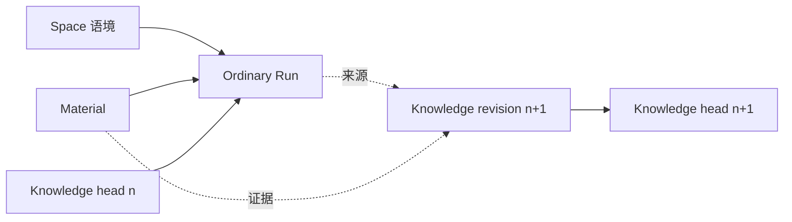

# 当工作开始拥有记忆：AgentArbor 的未来形态

日期：2026-07-31

性质：产品与架构方向研究。本文不是 ADR，也不直接构成当前实现任务。

## 引子：几个月后，我们回到这里

设想这样一个时刻。

几个月前，你曾经在 AgentArbor 里研究一个项目的工具系统。那时你读过一些代码，和 Agent 讨论了几轮，比较过几种方案，最后认为“工具的定义、授权和执行应该由同一个中心统一管理”。这个结论听起来完整，也确实指导了一段时间的开发。

后来，随着确认恢复、MCP 渐进曝光和 Sub-Agent 工具进入系统，原来的判断开始松动。问题并不是它完全错误，而是它把几种生命周期不同的事实放在了一起。你和 Agent 重新检查实现，发现工具定义可以被 catalog 冻结，执行器却必须在 run 边界真实存在，确认又属于具体调用。于是那条看似稳定的认识被修正了。

又过了几个月，你重新进入这个项目。

如果软件只保存了聊天记录，你会看到几十段问答，却不知道哪一段仍然有效；如果软件只保存了最终文档，你会看到现在的结论，却不知道它为什么变成这样；如果软件只保存了运行日志，你会知道当时调用过哪些工具，却无法理解那些行动改变了什么。

真正有价值的系统，不只是把这些东西都存下来。它应该能够告诉你：

> 我们最初怎样理解这个问题，什么事实动摇了原来的判断，哪次工作促成了修订，以及现在为什么选择相信这个版本。

这正是 AgentArbor 可能长成的形态。

它不是一款专门的学习软件，也不是聊天、文件和知识库的拼装。它更像一个能够陪伴工作跨越时间的认知工作台：工作在其中发生，理解在其中改变，而改变的来路不会随着一次对话结束而消失。

## 一、真正丢失的不是答案，而是答案之间的联系

今天的大多数 AI 产品都很擅长制造一个此刻看起来不错的答案。

用户提出问题，模型读取上下文，调用工具，然后生成结论。只要回答准确、过程顺畅，这次交互就算完成。下一次用户再来，系统或者依赖聊天历史，或者重新检索材料，再次生成一个答案。

这种方式解决了“如何得到结果”，却没有真正解决“理解如何延续”。

因为理解从来不是一组相互独立的答案。它更像一片不断改写的地形：新的材料进入后，旧判断的位置会发生变化；一次失败会让原本不起眼的约束变得重要；某个过去正确的方案，会因为环境改变而失去适用范围。我们不是简单地在知识库里增加一条新信息，而是在重新安排已有认识之间的关系。

这也是为什么完整聊天记录并不等于记忆。

聊天记录保留了时间顺序，却没有指出哪些话只是探索，哪些判断后来被推翻，哪些结论最终进入了长期理解。它像一条从未剪辑的录像：所有东西都在那里，但重看的人仍然需要重新完成一次理解。

最终文档也不等于记忆。

文档提供了一个干净的当前版本，却往往抹去了它形成的代价。读者知道“现在是什么”，却不知道“为什么不是以前那样”。当新的争议出现时，团队只能依靠人的记忆重新解释旧决定。

运行日志同样不等于记忆。

日志可以证明某次工具调用真实发生过，却不能替我们判断这次调用对长期认识意味着什么。一次测试失败可能推翻架构假设，也可能只是环境故障；它的语义不能由状态码自动决定。

因此，AgentArbor 真正需要连接的不是更多数据，而是三种原本彼此分离的时间：

```text
工作发生的时间：当时做了什么
理解变化的时间：当时改变了什么判断
当前使用的时间：现在以什么认识继续工作
```

只有这三种时间能够互相到达，过去的工作才不会沦为档案，当前的知识也不会变成失去来路的结论。

## 二、Space 不是容器，而是一个问题持续存在的地方

为了让理解跨越时间，首先需要一个能够承载连续性的地方。这个地方就是 Space。

Space 很容易被做成文件夹：用户创建一个空间，把文件、网页、笔记和对话拖进去，然后用标题和层级管理它们。这样的功能当然有用，但它没有触及 Space 最重要的价值。

Space 真正保存的是语境。

一个软件项目是 Space，因为其中的代码、架构判断、失败经验和未解决问题会持续相互影响；一个研究主题是 Space，因为材料会不断增加，旧解释会被新证据修正；一本书、一篇论文、一个产品方向，甚至一个长期困扰人的个人问题，都可以成为 Space。

它们的共同点不是“拥有一批文件”，而是“某种理解在这里持续形成”。

当用户进入一个 Space，软件不应该只是展示目录。它应该让用户重新站回上次离开的语境中：最近在处理什么，哪些材料刚被加入，当前形成了哪些认识，什么问题仍未解决，以及最近哪一次工作改变了原来的判断。

这种连续性不意味着 Space 要拥有所有东西。

文件仍属于文件系统，对话和运行仍属于 Ordinary Agent，知识修订仍属于 PersonalKnowledge。Space 只需要保存稳定引用，并在用户工作时把这些对象组织成一个可进入的语境。它不是新的全局状态，也不是一条强制工作流。

这一区分非常重要。

如果 Space 为了“理解上下文”而开始拥有 run 状态、知识仓储、Agent 记忆和文件正文，它很快就会成为另一个万能容器。所有功能都被放进去，边界反而消失。真正成熟的 Space 不吞并这些对象，它只是让对象之间的关系在一个持续主题下变得可见。

因此，进入 Space 和进入文件夹的感受应该不同。

进入文件夹是在查看东西放在哪里；进入 Space，是重新进入一个尚未结束的问题。

## 三、知识不是终点，而是理解在此刻的形状

如果 Space 保存语境，那么知识库保存什么？

最直接的回答是：保存笔记、材料和它们之间的链接。但这仍然把知识理解成了一批已经完成的对象。

更准确的说法是，知识库保存“当前最适合继续使用的理解”，同时保留它如何成为当前版本。

这里存在两个同样重要、但不应混淆的视角。

第一个视角是当前版本。

人在日常工作中需要一个相对稳定的落点。打开“工具执行边界”时，用户首先应该读到现在的结论，而不是被迫穿越四十次编辑历史。当前版本必须清晰、完整，可以直接支持下一次判断和行动。

第二个视角是形成轨迹。

当用户想知道某个结论为何出现、何时改变、依据是什么时，历史必须随时可达。旧版本不能因为被取代就失去意义，因为它记录了当时可见的事实、曾经成立的假设，以及后来发生变化的真正位置。

因此，一个知识对象不只是正文，而是“一个当前 head，加上一条不可变的 revision 序列”。

```text
《工具执行边界》

当前版本 revision 7
  “定义曝光、执行授权与调用确认是三个独立边界……”

形成轨迹
  revision 1  初始判断
  revision 2  加入 MCP 后修正定义来源
  revision 4  确认恢复暴露执行生命周期差异
  revision 7  Sub-Agent 工具接入后重新划分所有权
```

版本号本身没有多少价值。真正有认知价值的是每次修订旁边的几个问题：

- 相比上一版，什么发生了变化？
- 为什么需要改变？
- 改变来自哪些材料、运行结果或用户决定？
- 谁完成了这次修订？

当前 `PersonalKnowledge` 已经拥有一个非常接近这一方向的基础：Note 有当前 `revision`，Revision 保留 `baseRevision`、完整 Markdown、actor、trace 和 `changeSummary`。这意味着 AgentArbor 不必重新发明一套“认知数据库”。它需要做的，是让这些已经存在的事实从持久化细节变成产品的主要叙事。

知识由此不再是工作的终点。

它是理解在此刻暂时呈现出的形状。下一次工作可以使用它，也可以挑战它。

## 四、Agent 不负责宣布真理，它负责让变化能够发生

在这样的系统里，Agent 的角色会发生微妙但重要的变化。

它不再只是等待问题、生成回答的助手，也不是替用户自动维护知识库的书记员。它站在工作与理解之间：一边参与真实任务，一边帮助用户识别这次任务是否改变了已有认识。

这种参与首先来自“身处语境”。

当用户从某个 Space、一份材料或一个知识条目发起工作时，Agent 不应该要求用户再次解释“我们正在讨论哪个项目、刚才看的文件是什么、当前结论在哪里”。本轮明确选择的 Space、Material 和 Knowledge refs 应该随 run 出生而冻结，成为 Task Soil 的一部分。

这不是让工程替 Agent 猜测意图。

用户从全局输入框开始的普通任务仍然只是普通任务；只有用户从明确对象进入，或者主动选择了上下文，系统才携带这些引用。Space 提供语境，不能变成关键词路由器。

身处语境之后，Agent 仍然首先完成真实工作。

它读取文件、搜索知识、运行命令、比较方案、检查错误、调用 Sub-Agent 或请求确认。认知演化不能取代实际行动，否则产品会退化为一个只会讨论“我们如何理解”的元系统。

变化发生在工作之后，也可能发生在工作中。

Agent 发现新的代码事实与知识库中的描述不一致；一次测试证明旧假设不成立；两份材料给出互相冲突的解释；用户明确说“这改变了我之前的看法”。这些时刻不应该被一个自动规则捕获，而应该由 Agent 作出语义判断：现有知识是否值得修订？

如果答案是肯定的，Agent 提出的不应只是另一篇总结，而是一份“认知差异”：

```text
目标：工具执行边界 revision 6

本次变化：
- 将“工具中心统一拥有定义和执行”修正为三层独立边界
- 补充 frozen catalog 与 live executor 的生命周期差异

原因：
- MCP 渐进曝光不应提前连接 executor
- Sub-Agent definition 是 catalog-only contribution

来源：
- 当前 Ordinary run
- capability policy 测试
- ADR-0026、ADR-0027
```

用户看到正文 diff、变化摘要和来源，可以接受、调整或拒绝。接受后形成新的 revision；拒绝不会抹去这次 run 的真实过程。

Agent 因此拥有行动能力，却不获得真理特权。

模型输出始终是特定模型在特定上下文中形成的判断。即使它被写进知识库，也只是当前被接受的版本，而不是不可挑战的系统事实。可信不是“AI 说得很确定”，而是“这个判断的形成过程能够被检查”。

## 五、一次未来的工作会怎样展开

现在可以重新想象开头的场景，但这次把它放进完整的产品过程。

用户进入“AgentArbor”Space。

首页没有用大段文案介绍 Agent 能做什么。它安静地显示这个 Space 最近的状态：上次工作停在 MCP 工具边界，新增了两份实现材料，“工具系统设计”知识条目在三天前发生过一次修订，还有一个问题没有解决——Sub-Agent 工具是否应进入统一 ToolRegistry。

用户打开这个问题，旁边是当前知识条目的相关段落。然后他选择 `sub-agent-agent-tools.ts` 和 ADR-0026，输入：

> 检查当前实现是否真正遵守这里的边界。如果不是，说明问题在哪里。

这次对话出生时，Space、知识条目、两个材料引用和用户请求一起进入本轮上下文。Agent 不需要扫描整个知识库猜测用户在说什么，也不需要把整个 Space 全量塞进 prompt。

Agent 开始工作。

它读取代码和 ADR，检查 capability catalog 与 executor 装配，运行相关测试。过程中，它发现当前实现本身没有违反边界，但知识条目的表述已经过时：文字仍然暗示所有模型可见工具都必须在 ToolRegistry 中拥有 executor，而 Sub-Agent definition 实际上只进入 catalog，并由 Pi AgentTool 适配层提供执行。

Agent 在回答中解释这个差异，并给出证据。到这里，本次任务已经可以正常完成。

但它进一步判断：这个差异会影响未来开发，值得修订长期知识。于是回答下方出现一条克制的提示：

> 本次检查发现《工具系统设计》的当前表述与实现边界不一致。已准备一份修订建议。

用户展开建议，看见正文差异、变化摘要和三个来源引用。他修改了其中一句话，然后接受。

PersonalKnowledge 创建 revision 8。它保留 revision 7 的完整内容，记录最终接受修订的是用户，来源则包括 Agent 提案所在的 run、两份材料和一次测试结果。Conversation 显示“本轮修订了《工具系统设计》”，但这条摘要不会覆盖正式回答和工具事实。

半年后，另一个问题要求重新考虑 Sub-Agent 是否应该拥有独立 read-model。用户打开 revision 8，询问：

> 我们为什么当时坚持调用事实归父 Ordinary run？

Agent 不需要凭模糊记忆编造理由。它沿 revision 的来源回到当时的对话、ADR 和工具事实，解释这条边界如何形成，也指出当时没有考虑的新条件。

新的工作再次开始。

这就是这个产品最有辨识度的地方：它没有把一次回答包装成知识，也没有把知识冻结成答案。工作、理解与修订形成了一条可以继续向前的路径。

## 六、Workbench 最终会呈现出什么感觉

这种未来形态并不要求增加一个叫“认知演化”的复杂页面。恰恰相反，它应该渗透进用户已经熟悉的几个表面。

Home 是重新进入工作的地方。

它展示最近活跃的 Space、尚未解决的问题、等待确认的运行，以及最近真正改变了长期理解的修订。它不需要把所有东西做成信息卡，也不需要告诉用户系统有多少 AI 能力。用户来到这里，是为了知道“哪些事情仍在继续”。

Space 是工作获得连续性的地方。

材料、对话、知识和产物仍然保持各自身份，但选择可以在它们之间自然流动。用户从材料开始提问，从对话回到知识，从知识追溯来源，再从旧来源发起新的检查。Space 的价值不在于拥有这些对象，而在于让它们围绕同一个持续问题发生关系。

Conversation 是工作真正发生的地方。

模型正文、工具过程、错误、确认和结果仍然完整可见。在此基础上，它还可以显示本轮明确使用了哪些语境，以及这次工作新建或修订了哪些知识。知识影响只是额外投影，不能把完整回答折叠成一条产品摘要。

Knowledge 是当前理解与形成历史相遇的地方。

用户默认阅读当前版本，需要时查看 revision timeline、比较任意两版、检查来源，或者把旧内容恢复成一个新的 revision。恢复不是回滚数据库，而是一次新的认知动作：系统保留“后来曾经改变过，现在又为何重新采用”的完整事实。

Brain 是跨 Space 看见知识的地方。

它不是第二个内容仓库，而是当前知识、主题、链接和近期变化的全局投影。从 Brain 中选择条目并提问，应真实启动一个携带该条目引用的 Ordinary conversation，而不是让输入框看起来可以问、实际只执行字符串过滤。

Observation Panel 仍然负责监督运行。

它展示模型、工具、确认、Sub-Agent 和真实错误；知识 revision 不应替代运行可观察性。一个 revision 可以引用 run，但不能把 run 压缩成一段“AI 更新了知识”的文案。

这些表面组合起来以后，用户仍然只面对一个 Workbench。Agent 平台存在于底层，但用户感受到的是一种连续性：自己不必反复重建已经走过的理解。

## 七、系统必须诚实地区分三种事实

叙事最终必须落到清晰的数据边界，否则“保留理解过程”很容易变成一个吞噬所有状态的宏大概念。

系统至少要区分三种事实。

| 事实 | 回答的问题 | 当前 owner |
| --- | --- | --- |
| 工作事实 | 当时真实发生了什么 | Ordinary Agent / Tool facts |
| 认知修订 | 哪个长期理解发生了什么变化 | PersonalKnowledge Revision |
| 当前知识 | 现在以什么版本继续工作 | PersonalKnowledge Note head |

它们之间通过稳定引用形成单向关系：



Ordinary 继续拥有 conversation、run、工具事实和终态。它不因为一次回答“像知识”就自动写入 PersonalKnowledge。

PersonalKnowledge 继续拥有 Note、Revision、Link 和 Theme。它可以保存 originating run ref，却不能读取 Ordinary 的 store 来重建运行历史。

Space 继续拥有 Space 身份和顶层引用。它可以把显式选择交给 Task Soil，却不拥有 run 或 revision。

Workbench Shell 组合这些公开投影。它不能从 UI 文案猜测“本次形成了知识”，也不能直接写几个 feature 的仓储。

Agent Notes 和 PathMemory 也必须继续保持独立。

Agent Notes 是模型给未来自己留下的工作记忆，例如项目命令、用户偏好和已经验证的操作经验。它追求下一次执行更有效。

PersonalKnowledge 是用户可阅读、可修订、可追溯的长期理解。它追求认识能够跨时间继续发展。

PathMemory 是运行档案。它保存一轮任务实际走过的路径，服务审计、诊断和未来经验分析。它不因为“保留了历史”就成为知识演化史。

这种区分看起来克制，却决定了产品能否长期维护。只有不同生命周期的事实各有 owner，认知演化才不会退化成一个全局 EventStore 或 `CognitiveRuntime`。

## 八、AgentArbor 已经走到了哪里

这个未来并不是从空白开始。

Ordinary Agent 已经是一条真实执行主线。模型、工具、确认、取消、Session、工具事实、持久化和 read-model 都有明确边界。工作事实并不依赖 UI 模拟。

Space 已经拥有空间与顶层引用，并且没有复制外部文件正文，也没有夺取 conversation 的所有权。这使它有条件从“组织容器”继续成长为“持续语境”，而不必先偿还一次错误的统一模型。

PersonalKnowledge 已经拥有当前 Note 与不可变 Revision。`baseRevision` 防止静默覆盖，actor 可以区分 user、agent 和 system，traceId、goalId 与 toolCallId 已经为来源关联留下入口，`changeSummary` 也已经进入内部契约。

Agent Notes 已经让模型能够主动为未来自己写工作记忆；PathMemory 也已经从“长期记忆主线”降级为更诚实的运行档案。两个边界的存在，反而让用户知识能够拥有独立位置。

真正缺少的不是新内核，而是几座桥。

第一座桥连接 Space 与 Run。今天的 Space 主要组织引用，从某个 Space、材料或知识条目发起的对话，还没有完整形成可冻结、可重放的语境事实。

第二座桥连接 Run 与 Revision。Agent 可以创建和更新知识，但 `KnowledgeCreateNote` 与 `KnowledgeUpdateNote` 还没有把 change summary 和通用来源引用完整暴露为工具输入。

第三座桥连接 Revision 与用户。修订历史已经持久化，UI 目前主要把最新 revision 用于冲突保护，用户还不能自然地阅读形成轨迹、查看 diff 或回到 originating run。

第四座桥连接 Knowledge 与下一次工作。知识可以被搜索和读取，但从 Brain 或知识条目直接进入带上下文对话的体验还没有真正闭合。

所以当前项目与目标形态之间的距离，不是“还缺一个知识图谱”或“还缺一种 Agent 模式”。它缺的是让已有事实相互可达，同时不破坏所有权。

## 九、这条路应当怎样生长

第一步不是让 Agent 更主动，而是让历史变得可读。

知识条目需要一个真正面向用户的 revision timeline。用户能够查看每次变化的正文 diff、actor、change summary 和来源，也能把旧版本恢复成一个新的 revision。这一步让现有持久化事实第一次获得产品意义，而且不改变 Agent 主循环。

第二步是让 Agent 真正进入 Space。

从 Space、Material 或 Knowledge Note 发起对话时，把用户明确选择的引用冻结进 Task Soil。Conversation 显示这些上下文来源，重放时仍能说明本轮基于什么工作。这里不需要 Space 专用 runner，也不需要自动识别用户属于哪个 Space。

第三步才是让工作推动知识。

`KnowledgeCreateNote` 和 `KnowledgeUpdateNote` 接受 expectedRevision、change summary 与来源 refs。Agent 在语义上判断某次工作是否值得修订；如果值得，就通过现有工具与确认边界提交。Conversation 投影本轮知识影响，Revision 反向链接 originating run 和材料。

做到这里，最小闭环已经成立：

```text
进入语境
  -> 完成真实工作
  -> 发现理解变化
  -> 审阅认知差异
  -> 形成新 revision
  -> 下一次工作使用新的当前理解
```

更复杂的能力应该等待真实需要。

如果多个方向需要长期并存，可以让知识分支出生；如果出现大量跨文档事实冲突，可以评估 claim 或图查询；如果 revision 提案需要跨进程保存、多人审阅和批量接受，可以建立独立的 Proposal feature；如果历史规模使全文检索失效，再考虑向量索引。

顺序很重要。

产品应先证明用户确实需要回顾变化、使用来源和继续旧问题，再为这些需求建设更重的结构。否则“认知演化”会很快变成概念先行的复杂系统。

## 十、它最不应该变成什么

它不应该变成自动记录一切的监控系统。

保留过程不代表保存模型原始思维链、每个 token、所有临时草稿和全部工具噪声。那些内容既不稳定，也不等同于用户能够检查的理由。长期保留的应是外显修订、变化摘要、来源和正式运行事实。

它不应该变成会自动相信自己的知识机器。

如果每次回答都被总结后写入知识库，下一次模型又把这些总结当作事实，系统会形成难以察觉的自我强化。知识写入必须是显式语义动作，来源必须可见，旧版本必须可达。

它不应该变成知识图谱项目。

图可以帮助回答某些关系查询，但图结构本身不会产生理解。没有真实的跨对象冲突、时间关系和实体查询需求时，过早拆分 claim、confidence 和 valid-time，只会让用户维护模型制造的 schema。

它也不应该变成一套固定的认知状态机。

理解有时会收敛，有时会长期分歧，有时只是暂时够用。“草稿、验证中、稳定、已掌握”可以在具体场景中出现，却不应该成为所有知识必须通过的统一流程。工程可以记录边界，不能替用户和 Agent 判断一个认识是否成熟。

最后，它不应该为了宏大叙事破坏 AgentArbor 已经形成的模块边界。

不需要 `UniversalKnowledgeGraph`，不需要 `CognitiveRuntime`，也不需要一个把 Ordinary、Space、Knowledge、Agent Notes 和 PathMemory 全部接管的 `MemoryManager`。未来形态的力量恰恰来自这些对象各自诚实，再通过引用形成连续性。

## 结语：让理解能够继续

Agent 产品很容易追逐一种即时能力：更快的模型、更多的工具、更长的上下文、更复杂的协作。它们都能让一次任务变得更强，却不一定让用户在几个月后更容易回到自己已经走过的地方。

真正稀缺的也许不是生成另一个答案，而是让答案之间产生历史。

Space 让问题拥有持续存在的地方；Conversation 和 Run 让工作保留真实过程；Knowledge 保存当前最可用的理解；Revision 让被取代的判断仍然能够解释今天；Agent 则在它们之间工作、比较、质疑，并帮助新的变化获得清晰形状。

当这些关系成立以后，记录就不再是工作结束后的整理动作。它会成为工作本身自然留下的结构。知识也不再是一批被收藏的结果，而是一个能够回顾、修正和重新进入的过程。

那时，AgentArbor 最有价值的能力不会是替用户记住一切。

它会帮助用户知道：自己曾经怎样理解，为什么发生改变，以及接下来可以从哪里继续。

## 研究注记

本文的产品判断参考了以下思想，但不主张直接实现对应框架：

- Douglas C. Engelbart 关于“增强人的智力”的工作，把计算机理解为扩展复杂问题处理能力的环境，而不只是自动化工具。
- Donald A. Schön 的 reflective practice，强调专业理解会在行动与反思的往返中改变。
- Marlene Scardamalia 与 Carl Bereiter 的 Knowledge Building 研究，把知识视为可以被共同检查和持续改进的概念对象。
- Peter Pirolli 与 Stuart Card 的 sensemaking 研究，描述信息搜寻与结构建构之间的循环。
- W3C [PROV Overview](https://www.w3.org/TR/prov-overview/) 对 entity、activity 与 agent 的区分，为来源建模提供了最小参照。

与当前项目事实的关系主要依据：

- `CURRENT_RUNTIME_MODE.md`
- `docs/开发指南/01-基础/02-产品定义.md`
- `docs/开发指南/06-工程实现/11-功能模块边界与组合根.md`
- `docs/架构设计/产品架构/ADR-0028-AgentArbor统一Workbench与功能模块化单体架构.md`
- `docs/架构设计/产品架构/ADR-0032-路径记忆与长期记忆回流架构.md`
- `docs/架构设计/产品架构/ADR-0033-模型自主笔记记忆架构.md`
- `src/app/spaces/contracts.ts`
- `src/app/personal-knowledge/contracts.ts`
